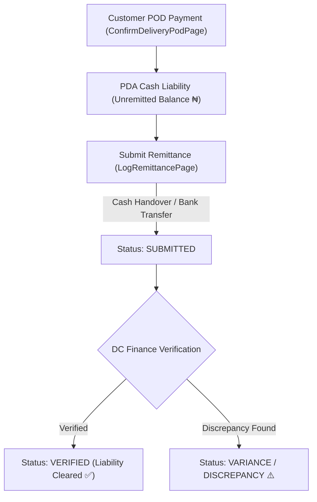

# Module 4: Cash Collection & Remittance Workflow 💰🏦

## 1. Overview & Financial Rules
For Pay-on-Delivery (POD) customer orders, field agents are responsible for collecting cash or verifying bank transfers from customers, holding collected funds securely, and remitting money to NovaExpress Central Finance.

### Core Financial Rules
1. **Currency**: All monetary values are strictly formatted in **Nigerian Naira (₦ / NGN)**.
2. **Collection Validation**: Agents must enter the exact amount collected. If collected cash does not match expected order amount, a variance reason must be logged.
3. **Verification Requirement**: A submitted remittance does NOT clear an agent's liability until **DC Finance verifies and approves** the payment receipt.

---

## 2. Cash & Remittance Lifecycle Diagram

---

## 3. Cash Dashboard Navigation (`CashPage`)

Navigating to **Tab 3 (CASH)** on the bottom navigation bar presents the **Cash Position**:

### A. Financial Summary Cards
- **POD Collected Today**: Total money collected from customers today (e.g. `₦145,000`).
- **Remitted Today**: Total money submitted and processed for remittance today (e.g. `₦80,000`).
- **Unremitted Cash Balance**: Current outstanding money held in agent custody requiring remittance (e.g. `₦65,000`).

### B. Action Buttons
- **LOG REMITTANCE**: Opens the remittance form to submit money to DC Finance.
- **REMITTANCE HISTORY**: Opens historical log of past submitted remittances.

---

## 4. Step-by-Step Cash Remittance Workflows

### Workflow 4.1: Submitting a Remittance (`LogRemittancePage`)
1. **Open Remittance Form**:
   - On the **Cash** tab, tap **LOG REMITTANCE** (or **SUBMIT REMITTANCE**).
2. **Review Available Balance**:
   - The screen automatically populates **Available to Remit**: `₦65,000`.
3. **Enter Remittance Amount**:
   - Type the exact amount being remitted (e.g. `65000`).
4. **Select Remittance Channel**:
   - 💵 **Cash Handover to DC Cashier**: Physical cash handed over at DC office.
   - 🏦 **Direct Bank Transfer**: Transfer made to NovaExpress corporate bank account.
5. **Enter Payment Reference**:
   - If **Bank Transfer**, enter the transaction reference / RRR code (e.g. `NEX-BNK-992019`).
   - If **Cash Handover**, select DC Cashier location (e.g. *Wuse DC Finance Desk*).
6. **Submit**:
   - Tap **SUBMIT REMITTANCE REPORT**.
   - **System Effect**:
     - Remittance status becomes `Submitted` (`pending`).
     - A unique Remittance ID (e.g. `#REM-00124`) is generated.

---

### Workflow 4.2: Inspecting Remittance Status & History (`RemittanceHistoryPage`)
1. **Open History**:
   - On the **Cash** tab, tap **REMITTANCE HISTORY** or view recent cards.
2. **Review Remittance Records**:
   Each record displays:
   - Remittance ID (e.g. `#REM-00124`)
   - Remitted Amount (e.g. `₦65,000`)
   - Channel (Cash / Bank Transfer)
   - Submission Timestamp
   - Status Badge:
     - 🟡 **SUBMITTED**: Pending DC Finance verification.
     - 🟢 **VERIFIED**: DC Finance verified funds; liability cleared.
     - 🔴 **DISCREPANCY**: Amount mismatch flagged by DC Finance.
3. **View Details (`RemittanceDetailsPage`)**:
   - Tap any remittance card to view transaction reference code, verified timestamp, and finance cashier signature notes.
