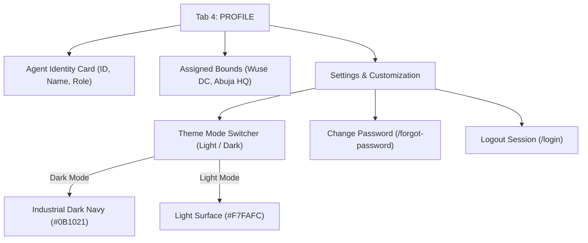

# Module 5: Profile, Security & System Theme Workflow 👤⚙️

## 1. Overview
The **Profile & Settings Module** manages agent identity verification, assigned operational location bounds (Distribution Center & Headquarters), security settings, and app visual theme preferences.

---

## 2. Profile & System Theme Architecture Diagram

---

## 3. Profile Screen Components (`UserProfilePage`)

Navigating to **Tab 4 (PROFILE)** on the bottom navigation bar presents the **Agent Profile**:

### A. Agent Identity Card
- **Agent Avatar / Initials**: Visual avatar.
- **Full Name**: e.g., *Emeka Okafor*.
- **Role Badge**: *Personal Distribution Agent (PDA)*.
- **Agent ID**: e.g., `#PDA-00124`.
- **Contact Info**: Registered Nigerian phone number (e.g. `08031234567`).

### B. Distribution Assignment Card
- **Assigned Distribution Center**: e.g., *Wuse Distribution Center*.
- **Assigned Headquarters**: e.g., *Abuja HQ (FCT)*.
- **Account Status**: 🟢 *Active / Field Authorized*.

---

## 4. Step-by-Step Profile & Customization Workflows

### Workflow 5.1: Switching System Theme (Light Mode vs Industrial Dark Mode)
NovaExpress PDA features full dynamic color tokening across all 100% of pages:

1. **Locate Theme Switcher**:
   - On the **Profile** tab, scroll to **App Preferences**.
   - Locate the **Dark Mode** toggle switch.
2. **Toggle Theme**:
   - **Dark Mode ON**: Applies sleek Industrial Dark Navy (`#0B1021` scaffold surface, `#151D36` cards, high contrast `#F8FAFC` text). Ideal for low-light field environments and battery saving.
   - **Light Mode ON**: Applies clean Light Surface (`#F7FAFC` scaffold, `#FFFFFF` cards, `#0F172A` text). Ideal for bright sunlight delivery environments.
3. **Instant System Application**: All text, icons, cards, input fields, and navigation elements dynamically update without app restart.

---

### Workflow 5.2: Resetting / Changing Password (`ForgotPasswordPage`)
1. **Initiate Reset**:
   - On the **Profile** tab under Security or on the Login screen, tap **Forgot Password?**.
2. **Enter Phone / Email**:
   - Type your registered phone number (e.g. `08031234567`) or agent email.
3. **Submit**:
   - Tap **SEND RESET CODE / INSTRUCTIONS**.
   - Follow SMS verification instructions to set a new password.

---

### Workflow 5.3: Session Logout
1. **Initiate Logout**:
   - On the **Profile** tab, scroll to the bottom and tap **LOG OUT**.
2. **Confirm Logout**:
   - Tap **Confirm Logout** in the modal dialog.
3. **System Effect**:
   - Terminates current Supabase authentication session.
   - Clears local agent cache.
   - Navigates securely back to `/login` screen.
