# NovaExpress Logistics — Field Agent Training & Workflow Guide 🚚📘

Welcome to the official **NovaExpress Personal Distribution Agent (PDA) Operational Training & Workflow Manual**. This documentation directory serves as the comprehensive field guide for training Personal Distribution Agents (PDAs) operating across Nigeria (Abuja, Lagos, Port Harcourt, and regional Distribution Centers).

---

## 🏬 3 Operational Fulfillment Scenarios Covered

```mermaid
flowchart TD
    subgraph S1 ["Scenario 1: Standard Order-First Pickup"]
        A1["Order Placed"] --> B1["Assigned to PDA"] --> C1["Pickup at DC"] --> D1["Customer Delivery"]
    end
    
    subgraph S2 ["Scenario 2: Failed Delivery Exception"]
        A2["Out for Delivery"] --> B2["Delivery Fails"] --> C2["Reattempt / Return to DC"]
    end
    
    subgraph S3 ["Scenario 3: Major Client Pre-Circulated Float Model"]
        A3["Bulk Float Issued to Vehicle"] --> B3["Standing Float Buffer"] --> C3["On-Demand Order Match"] --> D3["Instant Field Delivery"]
    end
```

---

## 📚 Training Module Directory

| Module | Document Title | Target Operational Focus |
| :--- | :--- | :--- |
| **Module 1** | [01. Daily Operational Journey](file:///c:/PROJECT/NoveXPS/DOCUMENTATION/WORKFLOW/01_overview_and_daily_journey.md) | Morning check-in, bulk float intake, dashboard KPIs, & end-of-day cash remittance. |
| **Module 2** | [02. End-to-End Orders Lifecycle](file:///c:/PROJECT/NoveXPS/DOCUMENTATION/WORKFLOW/02_orders_lifecycle_workflow.md) | Detailed workflows for Scenarios 1, 2, & 3 (Pre-circulated float model), POD collection, & failure logging. |
| **Module 3** | [03. Inventory & Stock Custody](file:///c:/PROJECT/NoveXPS/DOCUMENTATION/WORKFLOW/03_inventory_and_stock_management_workflow.md) | Vehicle stock balance (`quantityHeld = availableCount + allocatedCount`), bulk float allocation, free product rules, & stock history. |
| **Module 4** | [04. Cash Collection & Remittance Workflow](file:///c:/PROJECT/NoveXPS/DOCUMENTATION/WORKFLOW/04_cash_and_remittance_workflow.md) | POD cash management, variance reporting, bank transfer references, & DC remittance verification. |
| **Module 5** | [05. Profile, Security & System Theme](file:///c:/PROJECT/NoveXPS/DOCUMENTATION/WORKFLOW/05_user_profile_and_settings_workflow.md) | Profile verification, DC assignment, industrial dark/light theme switching, & security. |

---

## 🎯 Core Operating Principles for Field Agents

1. **Nigerian-First Operations**:
   - All financial amounts are strictly in **Nigerian Naira (₦ / NGN)**.
   - Address structures feature Nigerian States, LGAs, Landmarks, and specific delivery instructions.
   - Customer phone numbers format: `080...`, `081...`, `090...`, `070...`, or `+234...`.

2. **Dual Accountability System**:
   - **Physical Inventory Liability**: Stock units held in PDA vehicle float.
   - **Financial Cash Liability**: Cash collected from Pay-on-Delivery (POD) customer orders.
   - *Crucial Rule*: Cash held and Physical Stock held are tracked independently!

3. **Scenario 3 Floating Stock Model**:
   - Major Client items (*Grazer Herbal Tea, Respira, Alpha Man*) are circulated across PDA vehicles as standing float stock to enable instant same-hour delivery in the field without returning to the DC!

4. **Paid vs Free Product Distinction**:
   - Free promotional items (e.g. 5 Paid + 1 Free = 6 Physical Units) count toward physical vehicle inventory. Always verify physical package quantities before intake and handover.
