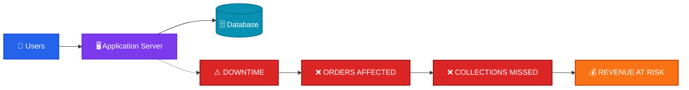
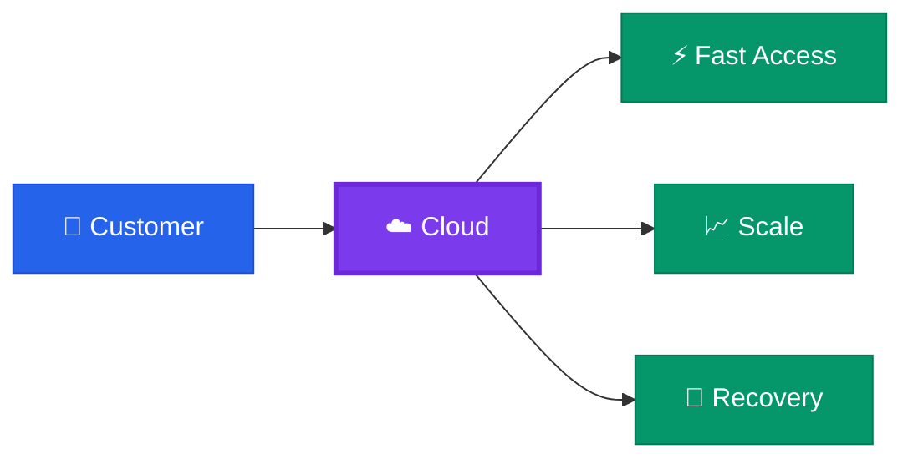
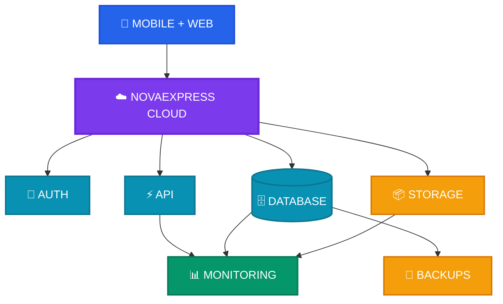
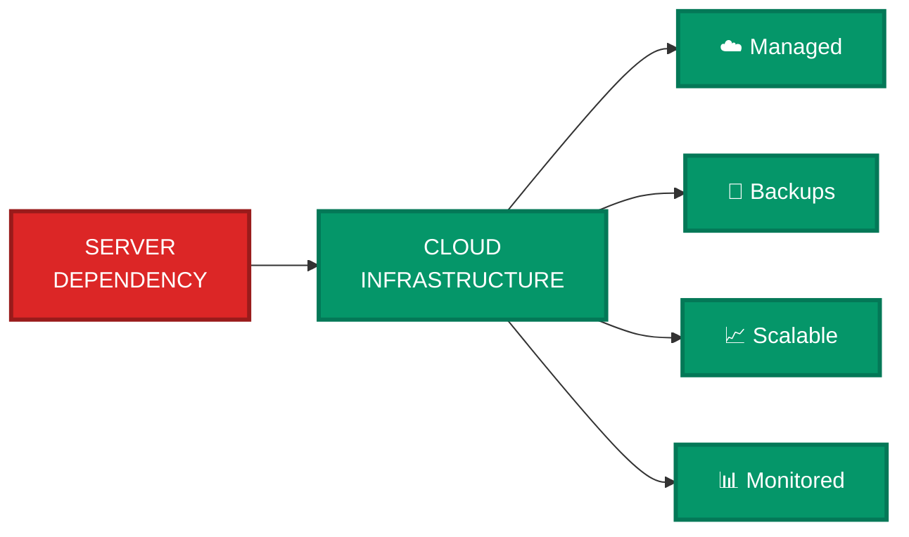
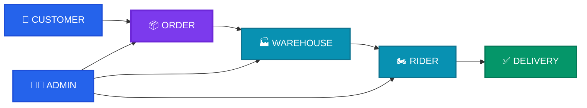

# NOVAEXPRESS

## Built for Reliable Operations

---

# 01 · THE PROBLEM

### ONE FAILURE → THE OPERATION STOPS

---

# 02 · THE IDEA

## THINK ABOUT FINTECH

### **Infrastructure matters.**

---

# 03 · NOVAEXPRESS

## FROM ONE SERVER → MANAGED CLOUD

---

# 04 · WHAT CHANGES?

---

# 05 · ONE PLATFORM

---

# 06 · THE RESULT

# NOVAEXPRESS

## **KEEPING THE OPERATION MOVING.**
