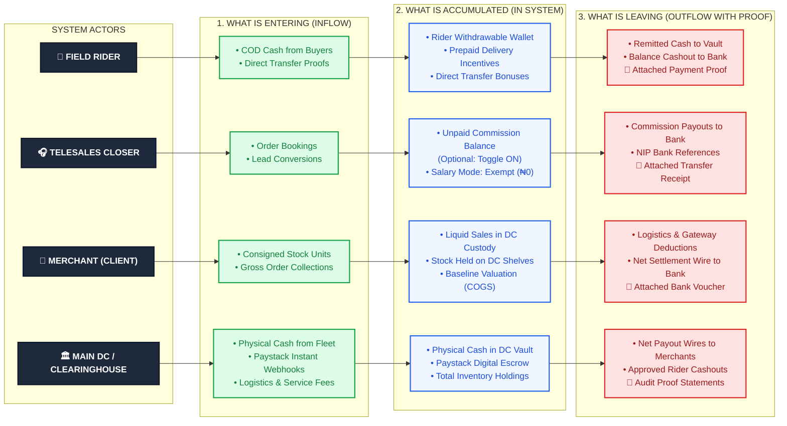
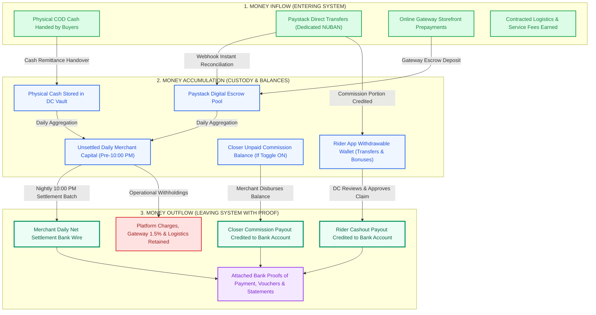
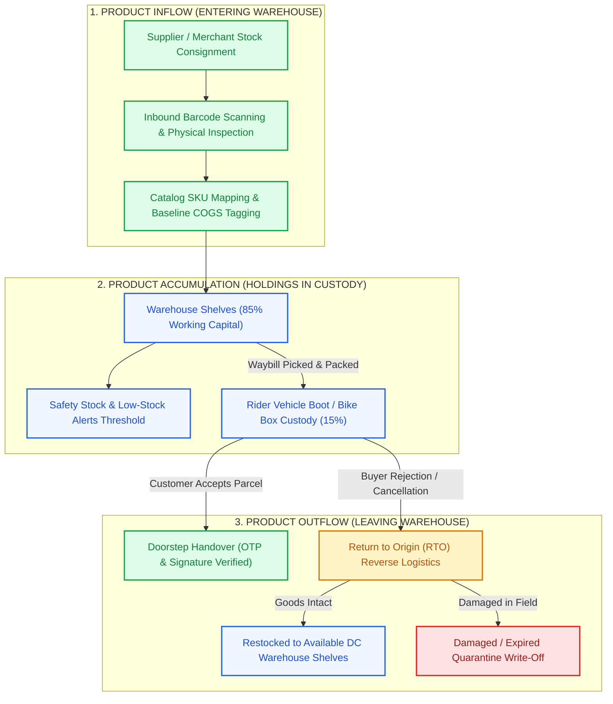
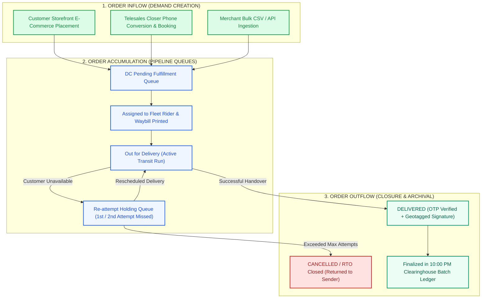
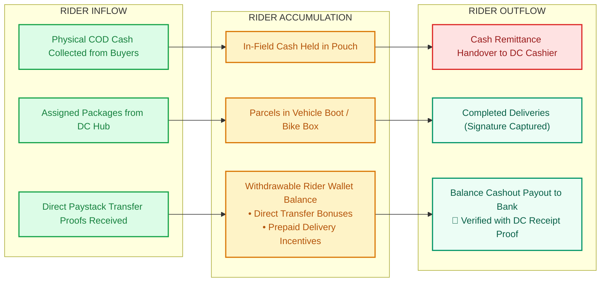
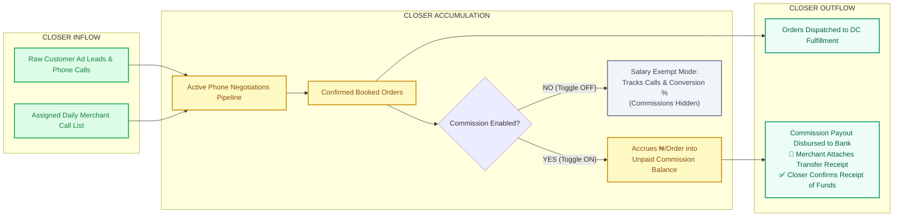
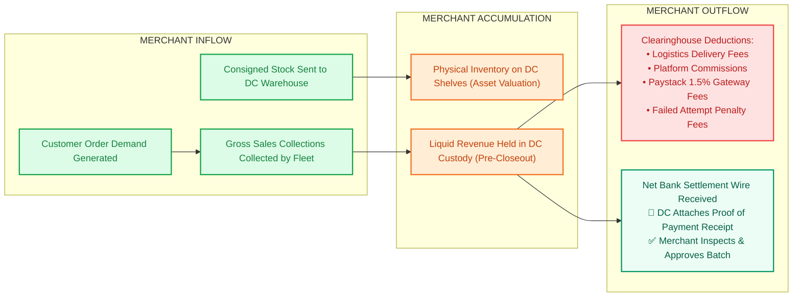
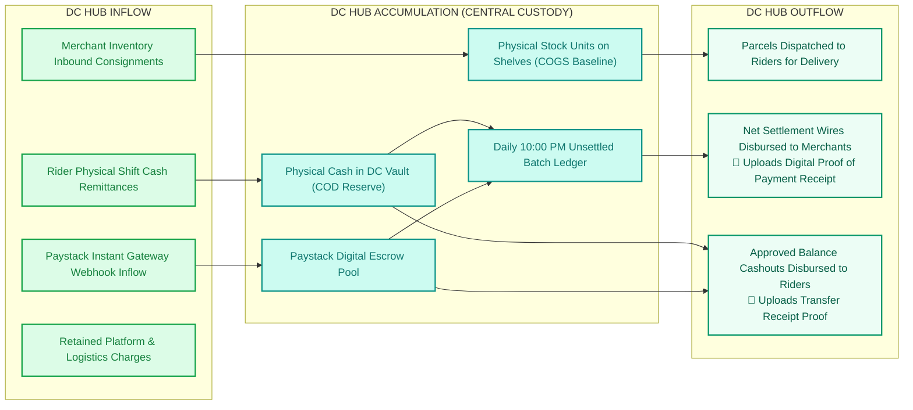

# NovaXpress Logistics & E-Commerce Clearinghouse
## Comprehensive Financial Flow Architecture & Settlement Engine

This document provides the complete, expanded architecture of the financial flows across all personas in the NovaXpress ecosystem: **End Customers**, **Field Riders**, **Distribution Centers (DCs)**, **Merchants (Clients)**, and **Telesales Closers**.

## 1. Executive Summary: What Enters, What Accumulates, and What Leaves

### Executive Financial Vector Matrix Across Main Actors

| Actor | 🟢 Entering the System (Inflow) | 🔵 Accumulated in the System (Custody / Wallets) | 🔴 Leaving the System (Outflow & Disbursements) | 📄 Proof & Receipt Verification Parity |
| :--- | :--- | :--- | :--- | :--- |
| **Field Rider** | • Buyer COD Cash Collections • Direct Transfer confirmations | • Withdrawable Rider Wallet • Direct transfer commissions • Prepaid delivery bonuses | • Cash Remittance handed to DC Vault • Balance cashout payout to personal bank account | DC manager attaches digital bank receipt; Rider opens zoomable viewer in app & confirms payout |
| **Telesales Closer** | • Customer order bookings • Phone conversions (generating gross commercial GMV) | • **When ON**: `unpaid_commission_balance` accrued per delivered parcel • **When OFF**: Exempt (Salary model, ₦0 balance) | • Commission disbursements paid to designated bank account | Merchant attaches bank payment receipt (PDF/image); Closer views receipt proof & confirms receipt of funds |
| **Merchant (Client)** | • Inventory deposited to warehouse • Gross buyer revenue collected | • Liquid cash held in DC custody (awaiting 10:00 PM batch) • Physical inventory held on DC shelves & vans (COGS) | • Deductions: Logistics fees, Platform commission, Paystack 1.5%, Failed attempt fees • Net Bank Settlement Wire | DC attaches bank transfer receipt; Merchant reviews itemized breakdown, inspects receipt document & approves |
| **Main DC / System** | • Fleet physical cash remittances • Paystack gateway webhook deposits • Earned logistics & platform fees | • Physical cash in DC Vault • Digital escrow funds in Paystack pool • Real-time inventory working capital | • Daily Net Settlement disbursements to Merchants • Approved balance cashout payouts to Riders | Main DC audit desk maintains full historical settlement records with receipt attachments and exportable statements |

---

## 2. Expanded Color-Coded Financial Flow Diagram

```mermaid
flowchart TD
    %% Custom Vibrant Color Classes
    classDef customerNode fill:#E0F2FE,stroke:#0284C7,stroke-width:2px,color:#0369A1;
    classDef inflowNode fill:#DCFCE7,stroke:#16A34A,stroke-width:2px,color:#15803D;
    classDef paystackNode fill:#DBEAFE,stroke:#2563EB,stroke-width:2px,color:#1E40AF;
    classDef riderNode fill:#FEF3C7,stroke:#D97706,stroke-width:2px,color:#B45309;
    classDef dcNode fill:#CCFBF1,stroke:#0D9488,stroke-width:2px,color:#0F766E;
    classDef engineNode fill:#EDE9FE,stroke:#8B5CF6,stroke-width:2px,color:#6D28D9;
    classDef deductionNode fill:#FEE2E2,stroke:#EF4444,stroke-width:2px,color:#B91C1C;
    classDef merchantNode fill:#FFEDD5,stroke:#F37021,stroke-width:2px,color:#C2410C;
    classDef bankNode fill:#ECFDF5,stroke:#059669,stroke-width:3px,color:#065F46;
    classDef receiptNode fill:#F3E8FF,stroke:#9333EA,stroke-width:2px,color:#7E22CE;
    classDef salaryNode fill:#F1F5F9,stroke:#64748B,stroke-width:2px,color:#334155;
    classDef closerNode fill:#FEF9C3,stroke:#CA8A04,stroke-width:2px,color:#854D0E;

    %% -------------------------------------------------------------
    %% LAYER 1: INFLOW CHANNELS
    %% -------------------------------------------------------------
    subgraph S1["1. MONEY IN: Customer Payment Inflow Channels"]
        Customer["End Customer / Buyer"]:::customerNode
        COD["Physical Cash on Delivery (COD)"]:::inflowNode
        PaystackTransfer["Paystack Direct Transfer (Virtual NUBAN)"]:::paystackNode
        OnlinePrepaid["Online Prepaid Checkout (Gateway)"]:::paystackNode

        Customer -->|"Hands Over Physical Naira"| COD
        Customer -->|"Direct Bank Transfer"| PaystackTransfer
        Customer -->|"Web / Card Payment"| OnlinePrepaid
    end

    %% -------------------------------------------------------------
    %% LAYER 2: FLEET INGESTION & DISPATCH
    %% -------------------------------------------------------------
    subgraph S2["2. FLEET INGESTION & REAL-TIME RECONCILIATION"]
        Rider["Field Rider / Delivery Agent"]:::riderNode
        CashRemittance["Daily Cash Remittance Handover"]:::inflowNode
        PaystackWebhook["Paystack Instant Settlement Webhook"]:::engineNode
        RiderWallet["Rider Incentive & Direct Transfer Wallet"]:::riderNode

        COD -->|"Collected by"| Rider
        Rider -->|"Physical Handover at Hub"| CashRemittance
        PaystackTransfer -->|"Instant Webhook Trigger"| PaystackWebhook
        OnlinePrepaid -->|"Automated Settlement"| PaystackWebhook
        PaystackWebhook -->|"Direct Commission Credit"| RiderWallet
    end

    %% -------------------------------------------------------------
    %% LAYER 3: CENTRAL DC CLEARINGHOUSE & ASSET CUSTODY
    %% -------------------------------------------------------------
    subgraph S3["3. CENTRAL DC CLEARINGHOUSE & ASSET CUSTODY"]
        DCClearinghouse["DC Clearinghouse Management"]:::dcNode
        DCVault["Physical Cash in DC Vault (COD Reserve)"]:::inflowNode
        PaystackPool["Paystack Custody Pool (Digital Escrow)"]:::paystackNode
        InventoryCustody["Physical Inventory in Custody (COGS Valuation)"]:::dcNode

        CashRemittance -->|"Manager Approves Handover"| DCVault
        DCVault -->|"Audited Balance"| DCClearinghouse
        PaystackWebhook -->|"Reconciled Ledger Entry"| PaystackPool
        PaystackPool -->|"Digital Capital"| DCClearinghouse
        DCClearinghouse -->|"Real-Time Asset Monitoring"| InventoryCustody
    end

    %% -------------------------------------------------------------
    %% LAYER 4: DAILY 10:00 PM SETTLEMENT CLEARINGHOUSE ENGINE
    %% -------------------------------------------------------------
    subgraph S4["4. 10:00 PM DAILY SETTLEMENT ENGINE & DEDUCTIONS"]
        SettlementBatch["Daily 10:00 PM Settlement Batch Engine"]:::engineNode
        GrossCollections["Gross Customer Collections (100%)"]:::inflowNode

        LogisticsFee["Logistics Delivery Fees Deducted (-)"]:::deductionNode
        PlatformFee["Platform Commission Fees Deducted (-)"]:::deductionNode
        GatewayFee["Paystack 1.5% Gateway Charges (-)"]:::deductionNode
        FailedFee["Failed Attempt Penalties Deducted (-)"]:::deductionNode

        NetDisbursable["Net Disbursable Working Capital (Calculated)"]:::bankNode

        DCClearinghouse -->|"Initiates Closeout"| SettlementBatch
        SettlementBatch -->|"Aggregates Delivered Orders"| GrossCollections

        GrossCollections --> LogisticsFee
        GrossCollections --> PlatformFee
        GrossCollections --> GatewayFee
        GrossCollections --> FailedFee

        LogisticsFee --> NetDisbursable
        PlatformFee --> NetDisbursable
        GatewayFee --> NetDisbursable
        FailedFee --> NetDisbursable
    end

    %% -------------------------------------------------------------
    %% LAYER 5: MERCHANT DISBURSEMENT & PARITY
    %% -------------------------------------------------------------
    subgraph S5["5. MERCHANT SETTLEMENT & DIGITAL RECEIPT PARITY"]
        DCDisbursement["DC Disburses Wire Transfer to Merchant"]:::dcNode
        SettlementReceipt["Attached Bank Transfer Receipt / PDF Voucher"]:::receiptNode
        MerchantBank["Merchant Verified Commercial Bank Account"]:::bankNode
        MerchantPortal["Merchant Finance Portal (Batches & Audit Ledger)"]:::merchantNode
        DCAuditDesk["Main DC Settlement History Ledger (Full Parity)"]:::dcNode

        NetDisbursable -->|"Authorized for Disbursement"| DCDisbursement
        DCDisbursement -->|"Generates Proof"| SettlementReceipt
        DCDisbursement -->|"NIP Direct Bank Transfer"| MerchantBank

        SettlementReceipt -->|"Click & Inspect Zoomable Receipt"| MerchantPortal
        SettlementReceipt -->|"Click & Inspect Zoomable Receipt"| DCAuditDesk

        MerchantPortal -->|"Merchant Confirms & Approves Payout"| SettlementBatch
    end

    %% -------------------------------------------------------------
    %% LAYER 6: TELESALES CLOSER FINANCIAL ARCHITECTURE
    %% -------------------------------------------------------------
    subgraph S6["6. TELESALES CLOSER ARCHITECTURE (TOGGLEABLE)"]
        CloserOnboarding["Merchant Onboards / Edits Closer"]:::merchantNode
        CommissionToggle{"Commission Enabled?"}:::engineNode

        %% OFF ROUTE
        SalaryCloser["Salary / Exempt Telesales Closer"]:::salaryNode
        OpsMetricsOnly["Operational Portal: Calls, Orders & Conv % Only"]:::salaryNode
        SalaryBadge["Merchant Ledger: 'Salary / Exempt' Badge (No ₦0 Error)"]:::salaryNode

        %% ON ROUTE
        CommissionCloser["Commission-Earning Telesales Closer"]:::closerNode
        CloserWallet["Withdrawable Commission Balance"]:::inflowNode
        CloserPayoutReq["Closer Payout Request (Bank + Amount)"]:::closerNode
        MerchantDisburseCloser["Merchant Disburses & Uploads Payment Receipt"]:::merchantNode
        CloserReceiptProof["Closer Payout Receipt Proof (PDF / Image)"]:::receiptNode
        CloserConfirmFunds["Closer Inspects Receipt & Confirms Funds Received"]:::bankNode

        CloserOnboarding -->|"Sets is_commission_enabled"| CommissionToggle

        CommissionToggle -->|"TOGGLED OFF"| SalaryCloser
        SalaryCloser -->|"Strictly Hides Commissions"| OpsMetricsOnly
        SalaryCloser -->|"Table & Card Rendering"| SalaryBadge

        CommissionToggle -->|"TOGGLED ON"| CommissionCloser
        CommissionCloser -->|"Delivered Orders Accrue ₦/Order"| CloserWallet
        CloserWallet -->|"Submits Request"| CloserPayoutReq
        CloserPayoutReq -->|"Merchant Review & Wire"| MerchantDisburseCloser
        MerchantDisburseCloser -->|"Attaches Bank Voucher"| CloserReceiptProof
        CloserReceiptProof -->|"Inspects in Viewer"| CloserConfirmFunds
        CloserConfirmFunds -->|"Marks Payout Completed"| CloserWallet
    end

    %% -------------------------------------------------------------
    %% LAYER 7: RIDER PAYOUT & INCENTIVE WITHDRAWAL
    %% -------------------------------------------------------------
    subgraph S7["7. RIDER BALANCE WITHDRAWAL & RECEIPT PROOF"]
        RiderPayoutReq["Rider Balance Payout Request (Prepaid & Transfers)"]:::riderNode
        DCReviewClaim["DC Reviews Payout Claim & Disburses NIP Transfer"]:::dcNode
        DCPaymentProof["DC Attaches Transfer Receipt Proof (PDF / Image)"]:::receiptNode
        RiderReceiptPreview["Rider Inspects Receipt in App & Confirms Receipt"]:::receiptNode
        RiderAccountCredited["Rider Personal Bank Account Credited"]:::bankNode

        RiderWallet -->|"Requests Cashout"| RiderPayoutReq
        RiderPayoutReq -->|"Dispatched to Hub Console"| DCReviewClaim
        DCReviewClaim -->|"Attaches Proof Document"| DCPaymentProof
        DCReviewClaim -->|"NIP Bank Transfer"| RiderAccountCredited
        DCPaymentProof -->|"Interactive Zoom Viewer"| RiderReceiptPreview
        RiderReceiptPreview -->|"Status: Completed"| RiderWallet
    end
```

---

## 2. Detailed Clearinghouse Financial Flow Stages

### Stage 1: Customer Inflow (`Money IN`)
Capital enters the NovaXpress system through three distinct channels:
1. **Cash on Delivery (COD)**: Handed directly to the delivery rider at customer doorstep. Held in rider physical custody until hub closeout.
2. **Paystack Direct Transfer (Virtual NUBAN)**: The customer initiates an instant bank transfer to a dynamic dedicated virtual account. Paystack webhooks reconcile the payment against the specific order within seconds.
3. **Online Prepaid Checkout**: Merchant e-commerce storefront prepayment, verified through the central gateway.

---

### Stage 2: Fleet Ingestion & Remittance
- **Cash Remittances**: Riders return to their parent Distribution Center at end of shift. The DC cashier counts the currency, performs denomination verification, and executes `approveCashRemittance(...)`. Funds transfer from *Rider In-Field Custody* to *DC Vault Physical Custody*.
- **Direct Transfers**: Handled 100% autonomously via Paystack webhooks. The rider's direct transfer commission is calculated and credited to their withdrawable wallet balance without manual cash counting.

---

### Stage 3: DC Clearinghouse Custody & Working Capital
The Distribution Center holds three simultaneous balances:
$$\text{Total Capital in Custody} = \text{Liquid COD in Vault} + \text{Paystack Digital Escrow} + \text{Physical Inventory (COGS Baseline)}$$

This real-time calculation ensures complete transparency into both cash flow and physical assets stored across warehouse shelves and vehicle boots.

---

### Stage 4: Daily 10:00 PM Merchant Settlement Formula
Every night at 10:00 PM, the automated clearinghouse engine aggregates all orders delivered during the cycle and applies the standard clearinghouse formula:

$$\text{Net Merchant Disbursed} = \text{Gross Collections} - (\text{Logistics Fees} + \text{Platform Commissions} + \text{Paystack Gateway Charges} + \text{Failed Attempt Charges} + \text{Auxiliary Charges})$$

- **Gross Collections**: 100% of order totals collected from buyers.
- **Logistics Delivery Fees**: Contracted delivery charge per completed waypoint.
- **Platform Commission Fees**: NovaXpress SaaS/brokerage commission.
- **Paystack Charges**: Actual 1.5% payment gateway processing charges incurred.
- **Failed Attempt Fees**: Small penalty applied to orders where multiple re-delivery attempts were scheduled.

---

### Stage 5: Merchant Settlement & Proof of Payment Parity
Both the **Merchant** and the **Main DC** share 100% feature parity:
- **Disbursement**: The DC officer executes the bank transfer and attaches a digital receipt (image or PDF) with a NIP bank reference (e.g. `STL-20260921-004`).
- **Interactive Receipt Viewer**: Powered by `PayoutReceiptPreviewDialog`, users can pinch, pan, zoom, copy payment references, and open high-resolution PDF vouchers.
- **Merchant Confirmation**: Merchants inspect the itemized breakdown and tap **Approve Settlement**, closing the ledger loop.

---

### Stage 6: Telesales Closer Dual-Path Model (Optional Commission)

The Telesales Closer module supports two distinct operational modes, configurable per closer:

| Feature | Toggled ON (`is_commission_enabled: true`) | Toggled OFF (`is_commission_enabled: false`) |
| :--- | :--- | :--- |
| **Closer Profile Badge** | `Commission Closer` | `Salary / Exempt Closer` |
| **Merchant Closer Detail** | Full commission rate, unpaid balance & paid totals | Performance KPIs only (Calls, Conversion %, Orders) |
| **Closer Mobile Dashboard** | Displays Withdrawable Balance & "Request Payout" | Displays Live Conversion Rate Card (No ₦ metrics) |
| **Payout Request Flow** | Enabled: Closer requests custom withdrawal amount | Disabled & completely hidden from UI |
| **Disbursement Flow** | Merchant disburses balance & attaches bank receipt | Merchant pays salary offline; no commission ledger |
| **Closer Receipt Viewer** | Closer views receipt proof & confirms receipt of funds | Not applicable |

---

### Stage 7: Rider Payout & Incentive Cashout
Riders withdraw accumulated earnings from prepaid deliveries and direct transfers:
1. **Request**: Rider requests balance payout in the mobile app.
2. **Approval**: DC manager inspects the rider's balance, authorizes the transfer, and uploads the bank receipt.
3. **Confirmation**: Rider receives instant notification, views the proof of payment in the interactive preview dialog, and confirms receipt.

---

## 3. Asset-Centric Lifecycle Flow Diagrams

### 3.1 Asset: Money & Capital Flow
This diagram illustrates the lifecycle of liquidity: how currency enters, accumulates in vaults and wallets, and exits the system with verified receipts.

---

### 3.2 Asset: Products & Physical Inventory Flow
This diagram tracks physical stock from supplier consignment through warehouse custody, dispatch, and final delivery or return.

---

### 3.3 Asset: Orders & Shipments Lifecycle Flow
This diagram maps an order from lead confirmation and booking through fulfillment queues to final proof-of-delivery archival.

---

## 4. Actor-Centric Lifecycle Flow Diagrams

### 4.1 Actor: Field Delivery Rider
Tracks what enters the rider's custody, what accumulates in their mobile app wallet, and what leaves as cash remittances and balance cashouts.

---

### 4.2 Actor: Telesales Closer (Dual-Path Architecture)
Tracks lead conversions, order bookings, optional commission accumulation, and merchant disbursements.

---

### 4.3 Actor: Merchant (Client / E-Commerce Brand)
Tracks inventory consignment, revenue collections held in custody, operational deductions, and net bank wire settlements.

---

### 4.4 Actor: Main DC / Central Clearinghouse (System Hub)
Tracks the central distribution center operations: fleet remittances, vault reserves, Paystack digital escrow, inventory custody, and disbursements.

---

## 5. Summary Matrix: Inflow vs. Accumulation vs. Outflow Across Assets & Actors

| Dimension | 🟢 Inflow (Entering) | 🔵 Accumulation (Inside System) | 🔴 Outflow (Leaving with Proof) |
| :--- | :--- | :--- | :--- |
| **Asset: Money** | COD cash, Paystack NUBAN transfers, online checkouts, service fee revenue | DC Cash Vault, Paystack digital escrow pool, Rider wallet balances, Closer commission balances, Unsettled merchant capital | Daily 10:00 PM Merchant net settlement wires, Rider cashout payouts, Closer commission payouts, Gateway & platform fee withholdings |
| **Asset: Products** | Merchant inbound consignments, barcode receiving, QC inspections | Warehouse shelf storage (85%), safety stock reserves, active rider delivery vehicle custody (15%) | Doorstep customer handovers, RTO reverse logistics, quarantine write-offs, shelf restocking |
| **Asset: Orders** | Buyer storefront checkout, Closer phone conversion, API / CSV bulk import | Pending fulfillment queue, fleet dispatch assignment, out-for-delivery transit, re-attempt holding queue | Delivered (OTP & digital POD signature), Cancelled / RTO closed, archived in nightly settlement batches |
| **Actor: Rider** | Assigned package waybills, buyer COD cash collections, direct transfer confirmations | In-field pouch cash, vehicle boot parcel custody, withdrawable wallet incentive balance | Cash remittance handed to DC cashier, completed deliveries with signature, balance cashout payouts to bank |
| **Actor: Closer** | Ad leads, phone inquiries, assigned call lists | Active negotiation pipeline, confirmed booked orders, *Optional* unpaid commission balance (if ON) | Confirmed order dispatches to DC, commission payouts disbursed to bank account with transfer receipt proof |
| **Actor: Merchant** | Supplier inventory shipments, customer sales orders, gross buyer collections | Physical stock on DC shelves (asset valuation), liquid sales revenue held in DC custody awaiting closeout | Operational fee deductions (logistics, gateway, platform, failed attempts), Net Bank Settlement wire with receipt |
| **Actor: Main DC** | Inbound consignments, rider cash remittances, Paystack gateway settlements, service fee earnings | Physical DC Vault cash, Paystack digital escrow pool, central warehouse inventory, daily unsettled batch ledger | Daily parcel dispatches to fleet, nightly Net Settlement wires to merchants with attached receipts, rider cashout payouts |

---

## 6. Database Schema & Stored Procedure Reference

### Key Tables
1. **`client_closers`**:
   - `is_commission_enabled` (`BOOLEAN DEFAULT TRUE`): Toggles commission mode.
   - `bank_name`, `account_number`, `account_name`: Disbursable bank credentials.
   - `unpaid_commission_balance`, `total_paid_commission`: Commission ledger balances.
2. **`closer_payouts`**:
   - Payout history with `proof_of_payment_url`, `disbursement_ref`, `status` (`pending`, `remitted`, `completed`), and timestamps.
3. **`client_settlements`**:
   - Clearinghouse settlement records with itemized deductions and `proof_of_payment_url`.
4. **`payout_requests`**:
   - Rider cashout requests with `proof_of_payment_url`, `disbursed_by_user_id`, and `rider_confirmed_at`.

### Core Database Functions
- `fn_disburse_closer_payout(p_closer_id, p_amount, p_disbursement_ref, p_proof_url)`: Disburses closer funds, updates balance, and logs receipt.
- `fn_closer_confirm_payout(p_payout_id, p_closer_id)`: Marks closer payout as verified and completed.
- `fn_disburse_payout_with_receipt(p_payout_id, p_proof_url, p_disbursed_by)`: Settles rider payout claim with attached bank receipt.
- `fn_confirm_rider_payout(p_payout_id, p_rider_id)`: Finalizes rider payout verification.

---

## 7. UI Components & Inspection Points

- **Receipt Previewer**: [`lib/core/widgets/payout_receipt_preview_dialog.dart`](file:///c:/PROJECT/NoveXPS/lib/core/widgets/payout_receipt_preview_dialog.dart)
- **Settlement Detail Modal**: [`lib/features/client_portal/presentation/widgets/client_settlement_detail_modal.dart`](file:///c:/PROJECT/NoveXPS/lib/features/client_portal/presentation/widgets/client_settlement_detail_modal.dart)
- **Merchant Finance Page**: [`lib/features/client_portal/presentation/pages/client_finance_page.dart`](file:///c:/PROJECT/NoveXPS/lib/features/client_portal/presentation/pages/client_finance_page.dart)
- **Main DC Finance Desk**: [`lib/features/dc_console/presentation/pages/dc_finance_page.dart`](file:///c:/PROJECT/NoveXPS/lib/features/dc_console/presentation/pages/dc_finance_page.dart)
- **Closer Portal Page**: [`lib/features/client_portal/presentation/pages/closer_mobile_portal_page.dart`](file:///c:/PROJECT/NoveXPS/lib/features/client_portal/presentation/pages/closer_mobile_portal_page.dart)
- **Rider Payouts Page**: [`lib/features/finance/presentation/pages/payouts_page.dart`](file:///c:/PROJECT/NoveXPS/lib/features/finance/presentation/pages/payouts_page.dart)

