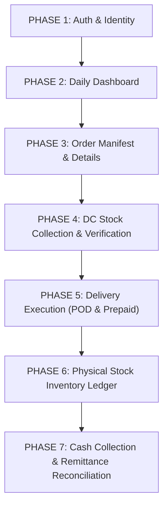

# NovaExpress Logistics — PDA Application Phase-by-Phase End-to-End Implementation Plan

**Product:** NovaExpress Logistics PDA Mobile Application  
**Target Market:** Nigeria (Currency: ₦ NGN)  
**Architecture:** Feature-First Clean Architecture (Flutter + Supabase)  
**Execution Rule:** Every phase is implemented strictly in 3 layers — **1. Database** (Schema, RLS, Seed Data) $\rightarrow$ **2. Backend/Services** (Supabase SDK, Datasources, Repositories, Edge Functions/RPCs) $\rightarrow$ **3. UI/Presentation** (Connected live with Zero Mock Data) — and fully tested before advancing to the next phase.

---

## Master Phase Overview

---

## Phase Breakdown & Specifications

### PHASE 1: Agent Authentication & Identity Management
**Target Screens:**
1. Login (`/login`) — `DOCUMENTATION/PDA/login`
2. Forgot Password (`/forgot-password`) — `DOCUMENTATION/PDA/forgot_password`
3. Profile Settings & Device Info (`/profile`) — `DOCUMENTATION/PDA/profile_settings`

#### 1. Database Layer
- Table `public.users`: Schema with `auth_user_id`, `email`, `first_name`, `last_name`, `phone`, `role` (`delivery_agent`), `is_active`.
- Table `public.delivery_agents`: Schema with `user_id`, `agency_id`, `coverage_states`, `current_cod_balance`, `max_cod_credit_limit`.
- Seed Data: Delivery Agent Emeka Rider (`rider.emeka@novaexpress.com`).

#### 2. Backend & Services Layer
- `AuthRemoteDataSource`: Supabase Auth `signInWithPassword`, `signOut`, `getCurrentUser`.
- `AuthRepository`: Auth token persistence, error translation, fallback profile resolution.
- `AuthNotifier`: State management for session, authentication states, and error handling.

#### 3. UI Layer
- Official NovaXpress Logo (`assets/images/logo.png`), Navy (`#0B1C48`) + Orange (`#F37021`) brand styling.
- Agent ID / Email input with validation, password visibility toggle, remember me checkbox.
- Profile details screen displaying Agent ID, Coverage Area, assigned DC, and app build version.

#### 4. Verification & Test Criteria
- Successful login with `rider.emeka@novaexpress.com` / `Password123!`.
- Persistence of user session across app restarts.
- Clean logout clearing session state.

---

### PHASE 2: PDA Dashboard & Daily Operations Overview
**Target Screens:**
4. Home / Daily Summary (`/`) — `DOCUMENTATION/PDA/home_daily_summary`

#### 1. Database Layer
- Real-time aggregations over `orders` where `delivery_agent_id = agent_id`:
  - Active Route Count (`status IN ('accepted', 'in_transit')`)
  - Delivered Today Count (`status = 'delivered' AND updated_at::date = CURRENT_DATE`)
  - Total POD Cash Collected (`SUM(total_amount) WHERE payment_type = 'pay_on_delivery' AND payment_status = 'collected'`)
  - POD Pending (`SUM(total_amount) WHERE payment_type = 'pay_on_delivery' AND status = 'in_transit'`)

#### 2. Backend & Services Layer
- Aggregation query/RPC `get_pda_dashboard_kpis(agent_id)`.
- Realtime stream listener on `orders` for live status updates.

#### 3. UI Layer
- Top AppBar with NovaXpress logo badge and Agent Name.
- 4 Responsive KPI Metric Cards:
  - **Active Route** (Orange badge, pending order count)
  - **Delivered Today** (Green badge, completed count)
  - **POD Collected** (Naira ₦ formatting, cash in custody)
  - **POD Pending** (Amber badge, cash to collect)
- Today's Assigned Deliveries list preview with Pull-to-Refresh.

#### 4. Verification & Test Criteria
- KPI cards update dynamically when orders change status.
- Pull-to-refresh correctly re-fetches latest metrics from Supabase DB.

---

### PHASE 3: Order Manifest & Delivery Dispatch
**Target Screens:**
5. My Orders / Manifest (`/orders`) — `DOCUMENTATION/PDA/orders_list`
6. Order Details (`/orders/:id`) — `DOCUMENTATION/PDA/order_details_nex_001`

#### 1. Database Layer
- Table `orders`: Fields for `order_number`, `customer_name`, `customer_phone`, `customer_alt_phone`, `delivery_state`, `delivery_city`, `delivery_address`, `status`, `quantity`, `base_price`, `upsell_amount`, `total_amount`, `payment_type`, `payment_status`, `delivery_notes`.
- Table `order_items`: Line item breakdown for paid units vs free promotional units.

#### 2. Backend & Services Layer
- `OrdersRemoteDataSource`: `getAssignedOrders(agentId)`, `getOrderById(orderId)`, `updateOrderStatus(orderId, status)`.
- Status filter implementation: `All`, `To Collect`, `Collected`, `Out for Delivery`, `Delivered`, `Failed`, `Returned`.

#### 3. UI Layer
- Order manifest card with POD badge (`Pay on Delivery` vs `Prepaid`), Naira amount, status chip.
- Order Details page featuring:
  - Customer contact card with direct phone call launcher (`tel:`).
  - Full Nigerian address format (Street, Area, City, State, Landmark).
  - Item breakdown separating **Paid Quantity**, **Free Quantity**, and **Total Physical Units**.
  - Route start action button ("Start Delivery Route").

#### 4. Verification & Test Criteria
- Manifest lists all 5 seeded orders for Emeka Rider.
- Status filters accurately isolate `Out for Delivery`, `Assigned`, `Delivered`, and `Failed` orders.
- Item breakdown explicitly shows paid vs free unit breakdown.

---

### PHASE 4: DC Stock Collection & Verification
**Target Screens:**
7. Load Truck / Batch Scan (`/stock/load-batch`) — `DOCUMENTATION/PDA/load_truck_batch_scan`
8. Order Collection (`/orders/collect`) — `DOCUMENTATION/PDA/order_collection`
9. Scan to Collect (`/orders/scan`) — `DOCUMENTATION/PDA/scan_to_collect`

#### 1. Database Layer
- Table `stock_transfers` & `stock_transfer_items`: Record transfer of stock from Distribution Center to PDA.
- Table `pda_stock_ledger`: Inventory records for products held in custody by the agent.

#### 2. Backend & Services Layer
- `StockRemoteDataSource`: Batch collection RPC `collect_orders_batch(agent_id, order_ids[])`.
- Verification logic: Ensure orders match assigned agent and DC before decrementing DC stock and incrementing PDA stock.

#### 3. UI Layer
- Barcode / QR Code Scanner screen (`mobile_scanner`).
- Batch item load list showing order numbers, customer name, physical units to collect.
- "Confirm Collection & Receive Stock" action modal with live confirmation summary.

#### 4. Verification & Test Criteria
- Barcode/QR scanner decodes order barcode.
- Confirming collection updates order status to `collected` / `in_transit` and credits PDA stock.

---

### PHASE 5: Delivery Execution & Outcomes (POD & Prepaid)
**Target Screens:**
10. Confirm Delivery POD (`/orders/:id/deliver-pod`) — `DOCUMENTATION/PDA/confirm_delivery_pod`
11. Delivery Success (POD) (`/orders/:id/success-pod`) — `DOCUMENTATION/PDA/delivery_success`
12. Delivery Success (Prepaid) (`/orders/:id/success-prepaid`) — `DOCUMENTATION/PDA/delivery_success_prepaid`
13. Log Delivery Failure (`/orders/:id/log-failure`) — `DOCUMENTATION/PDA/log_delivery_failure`
14. Schedule Reattempt (`/orders/:id/schedule-reattempt`) — `DOCUMENTATION/PDA/schedule_delivery_reattempt`

#### 1. Database Layer
- Update `orders.status` to `delivered` or `cancelled`.
- Update `orders.payment_status` to `collected` or `failed`.
- Insert audit record into `order_activities`.
- Automatic deduction of delivered physical units (Paid + Free) from `pda_stock_ledger`.

#### 2. Backend & Services Layer
- `DeliveryExecutionUseCase`: `completePodDelivery(...)`, `completePrepaidDelivery(...)`, `logFailedDelivery(...)`.
- Payment validation: Compare Expected Amount (₦) with Amount Collected (₦). Prompt for reason if variance exists.

#### 3. UI Layer
- POD Payment entry screen with ₦ Expected, ₦ Collected, payment method selector (Cash / Bank Transfer).
- Non-POD prepaid delivery confirmation screen (Amount to collect: ₦0).
- Delivery Success celebration summary sheet (Order #, Customer, Units Delivered, Payment Collected).
- Log Failure screen with reason selector (Customer unavailable, Phone unreachable, Wrong address, Refused, etc.) and notes input.
- Reattempt date & time picker modal.

#### 4. Verification & Test Criteria
- Marking POD order delivered updates `payment_status = 'collected'`, `status = 'delivered'`, and deducts stock.
- Prepaid order completion requires ₦0 payment entry.
- Failed delivery updates order status and logs failure reason.

---

### PHASE 6: PDA Physical Stock & Inventory Ledger
**Target Screens:**
15. My Stock (`/stock`) — `DOCUMENTATION/PDA/my_stock`
16. Stock Details (`/stock/:productId`) — `DOCUMENTATION/PDA/stock_details_grazer`
17. Stock History (`/stock/history`) — `DOCUMENTATION/PDA/stock_history`

#### 1. Database Layer
- Table `pda_stock_ledger` / `warehouse_inventory`: Ledger tracking product quantities per agent.
- Product catalog: Grazer Herbal Tea, Respira, Alpha Man, etc.

#### 2. Backend & Services Layer
- `StockRepository`: `getPdaStock(agentId)`, `getStockMovementHistory(agentId, productId)`.
- Calculations: Opening Stock + Received Stock - Delivered Stock - Returned Stock = Current Stock Balance.

#### 3. UI Layer
- My Stock overview screen with product cards, current unit count, and status badges.
- Stock Details page showing movement ledger breakdown (Opening, Received, Delivered, Returned, Current Balance).
- Low Stock warnings for products reaching minimum operational thresholds.

#### 4. Verification & Test Criteria
- PDA stock balance equals physical units collected minus units delivered.
- Stock detail ledger correctly displays movement history.

---

### PHASE 7: Cash Collection, Remittance & Reconciliation
**Target Screens:**
18. Cash Remittance Dashboard (`/cash`) — `DOCUMENTATION/PDA/cash_remittance`
19. Log Remittance (`/cash/remit`) — `DOCUMENTATION/PDA/log_remittance`
20. Remittance Details (`/cash/remittance/:id`) — `DOCUMENTATION/PDA/remittance_details`
21. Remittance History (`/cash/history`) — `DOCUMENTATION/PDA/remittance_history`
22. Delivery History (`/history/deliveries`) — `DOCUMENTATION/PDA/delivery_history`

#### 1. Database Layer
- Table `cash_remittances`: Record remittance transactions with `delivery_agent_id`, `amount`, `payment_method`, `reference_number`, `status` (`pending`, `submitted`, `verified`, `rejected`, `variance`), `notes`.

#### 2. Backend & Services Layer
- `RemittanceRemoteDataSource`: `submitRemittance(...)`, `getRemittanceHistory(...)`, `getRemittanceDetails(...)`.
- Financial balance calculation: Total POD Collected - Total Remitted = Outstanding Remittance Balance (₦).

#### 3. UI Layer
- Cash Dashboard featuring Total Collected ₦, Total Remitted ₦, and Outstanding ₦ cards.
- Log Remittance screen with Amount to Remit (₦), Remittance Method dropdown (Cash Deposit / Bank Transfer), and Bank Transfer Reference Number input.
- Remittance Details view displaying status badge (`Pending Verification`, `Verified`), verification timestamp, and receipt image / reference.
- Delivery History archive list with date range filter.

#### 4. Verification & Test Criteria
- Submitting remittance creates `cash_remittances` record in Supabase with `status = 'pending'`.
- Remittance history accurately tracks pending vs verified remittances.
- Financial position correctly reflects cash collected minus remitted.

---

## Execution Schedule & Protocol

1. **Sequential Execution**: We execute **Phase 1** through **Phase 7** in strict order.
2. **3-Layer Rule for Every Phase**:
   - Step 1: Database (Schema, tables, constraints, RLS, seed data)
   - Step 2: Backend/Services (Supabase Client, Datasources, Repositories, Use Cases)
   - Step 3: UI/Presentation (Connected directly to Supabase DB, 0 mock data)
3. **Phase Testing**: After completing each phase, run `flutter analyze` and integration tests before proceeding to the next phase.
