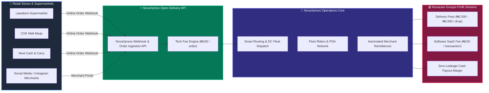
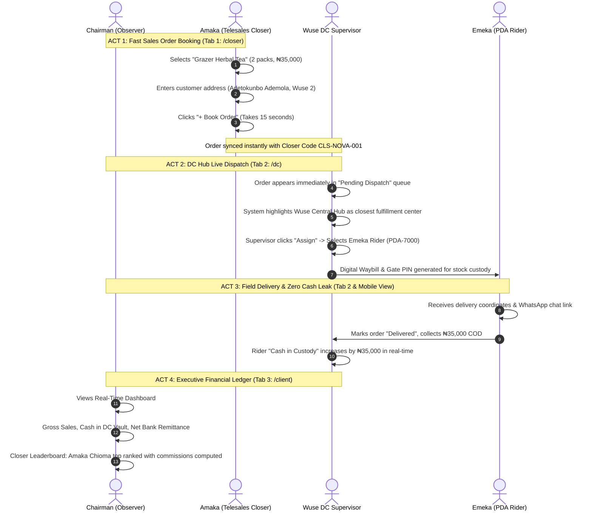
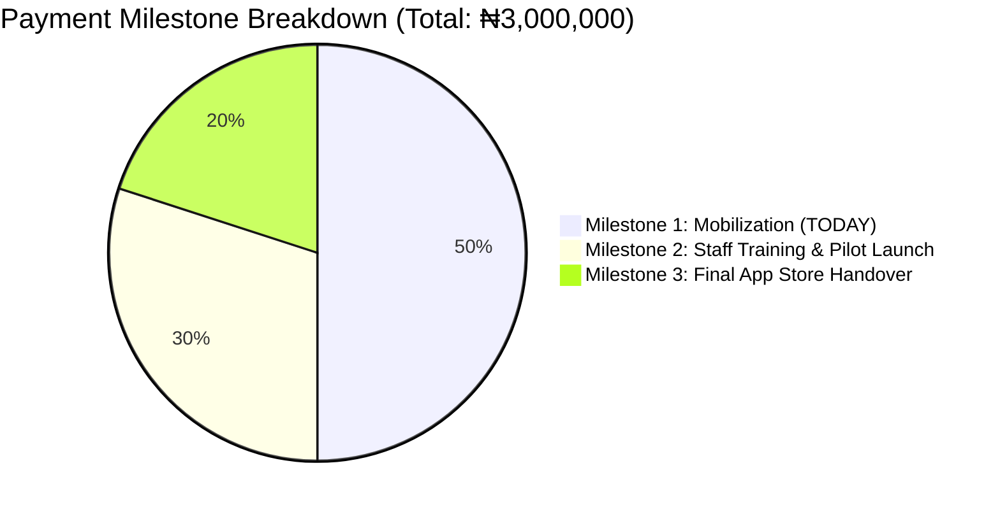
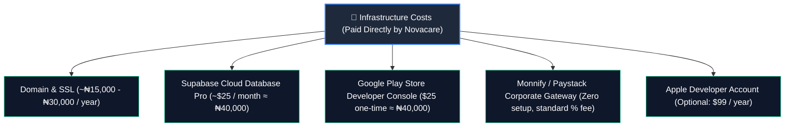
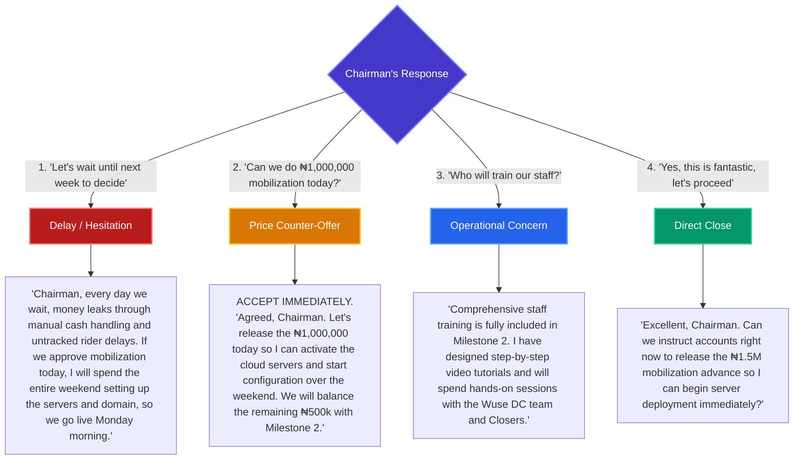

# 🚀 NovaXpress Enterprise Sales & Funding Master Guide
**Confidential Strategy Guide for Pitching the Chairman of Novacare Groups**

---

## 🎯 Executive Summary & The Golden Rule

> [!CAUTION]
> ### 🛑 Golden Rule #1: NEVER Mention Your House Rent or Personal Distress
> **Do NOT bring up your house rent, personal emergencies, or impending eviction to the Chairman.**
> In executive corporate culture, personal financial distress weakens your authority, damages perceived reliability, and risks turning a lucrative enterprise software deal into an awkward plea for personal assistance.
> 
> **The Winning Posture**:
> You are the **Lead Systems Architect** delivering a proprietary, enterprise-grade logistics and fulfillment engine. The **₦1,500,000 (50%) payment today** is strictly positioned as the **Mandatory Infrastructure & Deployment Mobilization Fee** required to configure production cloud servers, bind corporate domains, configure banking payment gateways over the weekend, and launch staff training on Monday morning.

---

## 📊 High-Level Operational Architecture

This diagram illustrates how the system unifies Novacare's e-commerce brands, logistics hubs, field riders, and financial reconciliation into one automated pipeline.

```mermaid
flowchart TD
    subgraph ECOMMERCE["🛒 Novacare E-Commerce Group"]
        style ECOMMERCE fill:#1E293B,stroke:#3B82F6,stroke-width:2px,color:#FFFFFF
        C1["Amaka Chioma (Closer)"] -->|Books Order in 15s| PO["Order Created (NOV-2026-XXXX)"]
        C2["Other Closers (Leafora / Nova)"] -->|Telesales Conversion| PO
    end

    subgraph DC_OPERATIONS["🏢 NovaXpress Hub Operations"]
        style DC_OPERATIONS fill:#0F172A,stroke:#10B981,stroke-width:2px,color:#FFFFFF
        PO -->|Auto-Routed by LGA / State| WUSE["Wuse Central Hub (DC-WUSE-01)"]
        WUSE -->|Gate PIN & Stock Custody| DISPATCH["Dispatcher Assigns Order"]
        DISPATCH -->|Real-time Push| RIDER["Emeka Rider (PDA-7000)"]
    end

    subgraph FIELD_DELIVERY["🛵 Field Delivery & Cash Reconciliation"]
        style FIELD_DELIVERY fill:#18181B,stroke:#F59E0B,stroke-width:2px,color:#FFFFFF
        RIDER -->|Delivery & WhatsApp Nav| CUST["Customer (AMAC / Wuse 2)"]
        CUST -->|Pay on Delivery (COD)| CASH["Cash / POS Collected"]
        CASH -->|Digital Custody Log| VAULT["DC Safe & Remittance Vault"]
    end

    subgraph EXECUTIVE_LEDGER["📈 Chairman Real-Time Financial Ledger"]
        style EXECUTIVE_LEDGER fill:#312E81,stroke:#8B5CF6,stroke-width:2px,color:#FFFFFF
        VAULT -->|Zero-Cash-Leak Audit| FIN["Gross Sales vs Net Remittance"]
        PO -->|Auto Attribution| COMM["Closer Commissions & Leaderboard"]
        FIN -->|Direct Bank Transfer| BANK["Novacare Corporate Bank Account"]
    end

    classDef blueBox fill:#2563EB,stroke:#60A5FA,stroke-width:2px,color:#FFFFFF;
    classDef greenBox fill:#059669,stroke:#34D399,stroke-width:2px,color:#FFFFFF;
    classDef orangeBox fill:#D97706,stroke:#FCD34D,stroke-width:2px,color:#FFFFFF;
    classDef purpleBox fill:#7C3AED,stroke:#C4B5FD,stroke-width:2px,color:#FFFFFF;

    class C1,C2,PO blueBox;
    class WUSE,DISPATCH greenBox;
    class RIDER,CUST,CASH,VAULT orangeBox;
    class FIN,COMM,BANK purpleBox;
```

---

## 🌐 The Grand Vision: The "Supermarket & B2B SaaS" Ecosystem

Show the Chairman how NovaXpress evolves from a cost center for Novacare into a **high-margin logistics software provider for physical supermarkets and retail stores across Abuja**.



---

## ⏱️ The 10-Minute Live Demo Walkthrough

Conduct the demonstration as a live story following an order's complete journey. Open three browser tabs before the meeting begins:



---

## 💼 Commercial Proposal & ₦3,000,000 Budget Architecture

### Value Anchoring
- **Market Comparison**: Building a custom multi-role platform (Merchant Admin, Closer Portal, DC Console, Rider App, Real-Time Messaging, Financial Remittance Ledger) via a software agency costs **₦12,000,000 – ₦18,000,000** and takes **6–9 months**.
- **Your Offer**: Fully operational, tailored specifically for Novacare Groups, deployable in days for **₦3,000,000 total**.



### Milestone Schedule:

| Milestone | Amount | Timing | Deliverables & Operations |
| :--- | :--- | :--- | :--- |
| **Milestone 1: Mobilization** | **₦1,500,000** (50%) | **TODAY (Mandatory Kickoff)** | Production server provisioning, corporate custom domain setup, database scaling, corporate Monnify/Paystack API configurations. |
| **Milestone 2: Staff Training & Pilot** | **₦900,000** (30%) | **Week 2** | Training of Novacare closers, Wuse DC warehouse staff onboarding, rider manifest setup, first live test order runs. |
| **Milestone 3: Production Sign-off** | **₦600,000** (20%) | **Week 3** | Google Play Store app release, full source code audit, operational handover. |

### Ongoing Maintenance & SaaS Platform Retainer
- **Fixed Model**: ₦150,000 – ₦250,000 / month (covers bug fixes, server uptime monitoring, database backups, minor feature additions).
- **OR Performance SaaS Model**: ₦100 – ₦150 platform infrastructure fee charged on every 3rd-party order processed through NovaXpress.

---

## 🛠️ Direct Third-Party Operational Setup Costs
Explain clearly that these are standard direct infrastructure subscriptions paid to external vendors:



---

## 🎯 Objection Handling Decision Tree

Use this flowchart to navigate the conversation if the Chairman raises objections or hesitates:



---

## 📝 Exact Word-For-Word Closing Script

When the demo ends, look him in the eye and deliver this closing:

> **You:**
> *"Chairman, as you can see, the core operating system is already built and functioning smoothly. It directly eliminates cash leakage in NovaXpress, automates order booking and commissions for Amaka and our telesales closers, and opens the door for us to offer delivery APIs to supermarkets like Lawalson and COK Mall across Abuja.
> 
> To enable me spend this entire weekend configuring the production cloud infrastructure, securing our corporate domain, and setting up the accounts so your team can begin onboarding on Monday morning:
> 
> **Can we authorize the 50% mobilization payment of ₦1,500,000 today so I can activate the licenses and begin deployment immediately?**"*

---

## 📋 Pre-Meeting Checklist

- [ ] **Laptop & Power Adapter**: Fully charged; screen wiped clean.
- [ ] **Mobile Hotspot**: Tested and active (do not rely on office Wi-Fi).
- [ ] **Browser Tabs Pre-loaded**:
  - **Tab 1**: Closer Portal (`http://localhost:port/#/closer`) — Logged in as Amaka Chioma.
  - **Tab 2**: DC Operations Console (`http://localhost:port/#/dc`) — Active Wuse Central Hub view.
  - **Tab 3**: Client Financials (`http://localhost:port/#/client`) — Novacare Health & Wellness Ltd dashboard.
- [ ] **Mental Posture**: Calm, authoritative, solution-focused. You are giving him a multi-million Naira competitive advantage.
