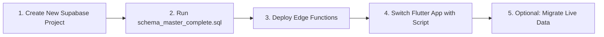

# 🚀 NovaXpress Supabase Migration Runbook

> **Target**: Transitioning the entire NovaXpress platform (Database, Storage Buckets, RLS, Stored Procedures, Edge Functions, Live Data, and Flutter Client) to a brand new Supabase project/account in **under 5 minutes**.

---

## 📋 Overview of the Migration Toolkit

NovaXpress is equipped with a turnkey, production-tested migration suite located in the repository:

| Tool / File | Purpose | Location |
| :--- | :--- | :--- |
| **`schema_master_complete.sql`** | **1-Click Full Backend SQL**: Sets up all 37 tables, 5 storage buckets, storage RLS, 27 production stored procedures, 2 triggers, indexes, and initial company/DC/client/rider seeds. | [`supabase/schema_master_complete.sql`](file:///c:/PROJECT/NoveXPS/supabase/schema_master_complete.sql) |
| **`deploy_all_functions.ps1`** | **1-Click Edge Function Deployer (Windows)**: Loops through all 12 Edge Functions and deploys them to the new project with `--no-verify-jwt`. | [`supabase/deploy_all_functions.ps1`](file:///c:/PROJECT/NoveXPS/supabase/deploy_all_functions.ps1) |
| **`deploy_all_functions.sh`** | **1-Click Edge Function Deployer (Mac/Linux)**: Bash equivalent for Unix environments. | [`supabase/deploy_all_functions.sh`](file:///c:/PROJECT/NoveXPS/supabase/deploy_all_functions.sh) |
| **`switch_supabase_env.py`** | **Instant App Switcher**: Switches Flutter app connection between projects in 1 second, or saves new account credentials. | [`scripts/switch_supabase_env.py`](file:///c:/PROJECT/NoveXPS/scripts/switch_supabase_env.py) |
| **`export_supabase_data.py`** | **Data Exporter**: Extracts all active business records across all 37 database tables into a JSON backup. | [`scripts/export_supabase_data.py`](file:///c:/PROJECT/NoveXPS/scripts/export_supabase_data.py) |
| **`import_supabase_data.py`** | **Data Importer**: Ingests exported JSON records into the new Supabase project across all 37 tables using conflict-safe upserts. | [`scripts/import_supabase_data.py`](file:///c:/PROJECT/NoveXPS/scripts/import_supabase_data.py) |
| **`supabase_environments.md`** | **Environment Vault**: Documents known Supabase project URLs, Anon Keys, and Service Role Keys. | [`supabase_environments.md`](file:///c:/PROJECT/NoveXPS/supabase_environments.md) |

---

## ⚡ The 4-Step Migration Workflow



---

### Step 1: Create Your New Supabase Project

1. Log into your new or existing Supabase account at [supabase.com/dashboard](https://supabase.com/dashboard).
2. Click **New Project**, select your organization, name it (e.g. `NovaXpress-Prod`), choose your region (e.g. `London (eu-west-2)` or closest), and set a secure database password.
3. Once initialized, navigate to **Project Settings** ➡️ **API** and copy:
   - **Project URL** (e.g. `https://yournewproject.supabase.co`)
   - **Project Ref** (e.g. `yournewproject`)
   - **Anon Public API Key**
   - **Service Role Secret Key**

---

### Step 2: 1-Click Database & Storage Provisioning

You do **not** need to run 45 individual migration files manually. We have compiled the complete, authoritative, dependency-ordered backend schema into a single file:

1. In your new Supabase Project Dashboard, click **SQL Editor** in the left sidebar.
2. Click **New Query**.
3. Open [`supabase/schema_master_complete.sql`](file:///c:/PROJECT/NoveXPS/supabase/schema_master_complete.sql) in your editor, copy all contents, paste it into the Supabase SQL Editor.
4. Click **RUN** (▶️).

> [!TIP]
> Execution takes approximately **10 to 15 seconds**. Upon completion, your new Supabase backend has:
> - **5 Storage Buckets**: `avatars`, `products`, `pod-proofs`, `remittance-proofs`, `receipts` (all public RLS configured).
> - **37 Relational Tables**: Full schema with multi-tenant company support, distribution centers, warehouses, products, packages, batches, orders, order activities, chat pipelines, telesales closers (`client_closers`), customer leads (`customer_leads`), stock transfers/handovers/returns, cash remittances, rider transactions, Paystack/Monnify virtual accounts & transactions, audits, and daily settlements.
> - **29 Production Stored Procedures (RPCs)**: Zero-variance 3-way daily settlement engine (`fn_generate_merchant_daily_settlement`), merchant asset custody valuation (`fn_calculate_merchant_asset_custody`), auto-dispatch with LGA proximity matching (`auto_dispatch_order`), two-way stock handshake, cash remittance verification, gate pin geocoding, rider GPS telemetry, driver entitlement deduction, ownership transfer, and chat unread management.
> - **2 Realtime Notification & Chat Triggers**: Automatic order conversation sync (`fn_sync_order_conversation` with closer avatar attribution) and unread counter increments (`fn_on_order_message_inserted`).
> - **Seed Baseline**: Default company, Wuse Central DC (Grand Hub), Garki DC, Novacare client with custom tariffs (₦5,000 delivery, ₦1,000 failed attempt, ₦500 platform fee), catalog products, and default seed accounts (Admin, DC Manager, PDA Rider, Novacare Merchant, and Novacare Telesales Closers).

---

### Step 3: Deploy All Edge Functions (1 Command)

Open your terminal in the project root (`c:\PROJECT\NoveXPS`):

#### On Windows (PowerShell):
```powershell
.\supabase\deploy_all_functions.ps1 -ProjectRef <your-new-project-ref>
```

#### On Mac / Linux (Bash):
```bash
chmod +x ./supabase/deploy_all_functions.sh
./supabase/deploy_all_functions.sh <your-new-project-ref>
```

The script will automatically link to your project and deploy all 12 Edge Functions:
- `auto-stock-alert`
- `confirm-delivery-pod`
- `dispatch-order`
- `generate-daily-settlements`
- `geocode-and-dispatch`
- `log-delivery-failure`
- `monnify-webhook`
- `paystack-webhook`
- `request-balance-payout`
- `request-stock-transfer`
- `submit-cash-remittance`
- `update-rider-telemetry`

#### (Optional) Set Paystack Secrets on New Project:
```bash
supabase secrets set PAYSTACK_SECRET_KEY=sk_test_... PAYSTACK_PUBLIC_KEY=pk_test_...
```

---

### Step 4: Switch the Flutter App Connection

To point your Flutter app to the new Supabase project, simply run the environment switcher script:

```bash
python scripts/switch_supabase_env.py --url "https://yournewproject.supabase.co" --anon-key "YOUR_ANON_KEY" --service-key "YOUR_SERVICE_ROLE_KEY" --name "Production 3"
```

> [!NOTE]
> What this does automatically:
> 1. Updates [`lib/core/constants/supabase_constants.dart`](file:///c:/PROJECT/NoveXPS/lib/core/constants/supabase_constants.dart) with the new URL and keys.
> 2. Automatically updates `PaystackConstants.webhookUrl` to use the new project endpoint (`https://yournewproject.supabase.co/functions/v1/paystack-webhook`).
> 3. Logs the new credentials in [`supabase_environments.md`](file:///c:/PROJECT/NoveXPS/supabase_environments.md) for future reference.

#### Switching Between Saved Accounts Anytime:
To view all saved accounts:
```bash
python scripts/switch_supabase_env.py --list
```
To switch back to another account:
```bash
python scripts/switch_supabase_env.py --switch testing
# or
python scripts/switch_supabase_env.py --switch production
```

#### Running Flutter with Build-Time Overrides (Zero Code Edits):
You can also launch Flutter specifying the target Supabase project via compile-time variables:
```bash
flutter run -d chrome --dart-define=SUPABASE_URL=https://yournewproject.supabase.co --dart-define=SUPABASE_ANON_KEY=YOUR_ANON_KEY
```

---

### Step 5: (Optional) Migrate Live Business Data from Old Account

If you have existing orders, inventory balances, client profiles, or pipeline chat messages in your old Supabase project that you want to transfer into the new project:

#### 1. Export Data from Old Account:
```bash
python scripts/export_supabase_data.py --url "https://old-project.supabase.co" --service-key "OLD_SERVICE_ROLE_KEY"
```
*Output: A clean, timestamped backup file in `backups/supabase_export_YYYYMMDD_HHMMSS.json`.*

#### 2. Import Data into New Account:
```bash
python scripts/import_supabase_data.py --file "backups/supabase_export_YYYYMMDD_HHMMSS.json" --url "https://new-project.supabase.co" --service-key "NEW_SERVICE_ROLE_KEY"
```
*The script upserts all records in strict foreign-key dependency order without primary key collisions.*

---

## 🔍 Verification Checklist

After migrating, run these quick verification checks:

1. **Flutter App Check**:
   - Run `flutter test test/negotiated_operational_charges_test.dart` (validates client finance logic).
   - Launch app: `flutter run -d chrome`.
   - Log into DC Console or Client Portal; confirm orders and products load from the new project.
2. **Storage Check**:
   - In Supabase Dashboard ➡️ **Storage**, verify that all 5 buckets exist: `avatars`, `products`, `pod-proofs`, `remittance-proofs`, `receipts`.
3. **Edge Functions Check**:
   - In Supabase Dashboard ➡️ **Edge Functions**, verify all 12 functions are listed as **Active**.
4. **Realtime Check**:
   - In Supabase Dashboard ➡️ **Database** ➡️ **Publications**, verify `supabase_realtime` has tables enabled for live order and chat updates.

---

---

## 🛡️ Proactive Safeguards: Avoiding Common Migration Pitfalls

We conducted a forensic audit of the live database, Edge Functions, and client codebase to eliminate the top failure modes in Supabase migrations:

| Potential Complication | What Goes Wrong | How NovaXpress Prevents It |
| :--- | :--- | :--- |
| **PostgREST Schema Cache Delay** | Calling a newly created RPC stored procedure returns HTTP 404 for up to 5 minutes after migration until PostgREST reloads. | [`schema_master_complete.sql`](file:///c:/PROJECT/NoveXPS/supabase/schema_master_complete.sql) ends with `NOTIFY pgrst, 'reload schema';` forcing PostgREST to recognize all 12+ RPCs instantly. |
| **Silent Realtime Stream Failure** | Orders, chat messages, and notifications stop updating live in the UI on a new account. | Configured `REPLICA IDENTITY FULL` on all streaming tables and automatically registered them in `supabase_realtime` in the master migration. |
| **Storage Bucket Permission Denied** | POD image uploads, rider avatars, and signature PNGs fail with 403 Forbidden. | Provisioned all 5 buckets with explicit `SELECT`, `INSERT`, `UPDATE`, and `DELETE` RLS policies on `storage.objects`. |
| **Stale Edge Function Fallbacks** | Edge functions contain hardcoded fallback URLs that talk to the old project if env vars aren't passed. | Removed all hardcoded URLs from `paystack-webhook` and `generate-daily-settlements`; all 12 functions now resolve `SUPABASE_URL` cleanly from the active environment. |
| **Hardcoded UUID Fallbacks** | Auth datasource and Edge Functions use fallback UUIDs (e.g. `'22222222-2222-4222-8222-222222222222'` for Grand DC). If the seed had different UUIDs, routing would fail. | Synchronized seed data in [`schema_master_complete.sql`](file:///c:/PROJECT/NoveXPS/supabase/schema_master_complete.sql) to strictly match all established production fallback UUIDs. |
| **Paystack Webhook Desynchronization** | Webhook points to an old/stale project ref (`vacyxnehxpqvwtaimkgc`), causing payments not to mark delivered orders. | Dynamically derived `paystackWebhookUrl` in Flutter from `supabaseUrl`. |
| **RPC Overload Ambiguity (HTTP 300 / PGRST203)** | Overloading stored procedures with overlapping default arguments causes PostgREST to return HTTP 300 Multiple Choices. | Removed redundant overloads; defined a single unified function `fn_generate_merchant_daily_settlement` that cleanly handles 2, 4, 5, or 6 arguments via default values. |
| **Zero-Order Ghost Settlements** | Running closeout when no delivered orders exist created empty ₦0.00 records in `client_settlements`. | Built-in zero-order validation guard immediately returns `{"success": false, "error": "..."}` without writing empty database rows. |

---

---

## 🧑‍💻 Production Standard Dynamic Authentication & Role Matrix

NovaXpress operates under strict enterprise multi-tenant isolation with zero hardcoded credentials, mock fallbacks, or artificial IDs in production paths:

1. **Authentication Flow**: Every login invokes `supabaseClient.auth.signInWithPassword`. If an Agent Code (`PDA-7000`), Closer Code (`CLS-NOVA-001`), or Client Code (`CLI-NOVACARE-01`) is entered, the backend dynamically resolves the identifier to the registered email address from the corresponding database table.
2. **Dynamic Profile Hydration (`_fetchUserProfile`)**:
   - **Merchant Admins**: Resolves business entities dynamically from `public.clients` (tariffs, company name, contact person, bank details).
   - **Telesales Closers**: Resolves identity from `public.client_closers` (closer code, quota targets, commission per converted order, avatar photo, linked client company).
   - **DC Logistics Supervisors**: Resolves hub jurisdiction dynamically from `public.distribution_centers` (hub code, manager name, operating zones, parent/regional links).
   - **Field Delivery Agents**: Resolves motorcycle/vehicle details, cash custody, and DC links from `public.delivery_agents`.

### 🔑 Verified Role Credentials Reference:

| Target Console | Role | Name | Login Email / Identifier | Password | Database UUID |
| :--- | :--- | :--- | :--- | :--- | :--- |
| **Merchant Portal (`/client`)** | Client Admin | Dr. Chuka Okafor | `merchant@novacare.com` | `Password123!` | `00000000-0000-4000-8000-789382731303` |
| **Closer Portal (`/closer`)** | Telesales Closer | Amaka Chioma | `closer@novacare.com` | `Password123!` | `44444444-4444-4444-8444-444444444444` |
| **Closer Portal (`/closer`)** | Telesales Closer | Chidinma Eze | `chidinma.closer@novacare.com` | `Password123!` | `55555555-5555-4555-8555-555555555555` |
| **DC Console (`/dc`)** | DC Manager | Ahmed Bello | `dc.supervisor@novaxpress.ng` | `Password123!` | `a2222222-2222-4222-8222-222222222222` |
| **Rider PDA (`/`)** | Delivery Agent | Emeka Rider | `rider.emeka@novaxpress.com` | `Password123!` | `a1111111-1111-4111-8111-111111111111` |

---

## 🏁 Summary of Transition Readiness

With this toolkit installed in your workspace:
- **No manual table creation needed**: 1-click execution in Supabase SQL editor via [`schema_master_complete.sql`](file:///c:/PROJECT/NoveXPS/supabase/schema_master_complete.sql).
- **No missing functions or broken triggers**: All 29 stored procedures include the latest negotiated charges (₦5,000 delivery fee, ₦1,000 failed delivery, ₦500 platform fee), 3-way split logic, and telesales closer attribution.
- **No hardcoded stale URLs or IDs**: All webhook and service endpoints resolve dynamically from the active project.
- **Full Data Portability**: Export and import scripts allow moving all 37 database tables between Supabase accounts whenever needed with zero schema corruption.
- **Instant Account Switching**: Switch environments in 1 second via `python scripts/switch_supabase_env.py`.

