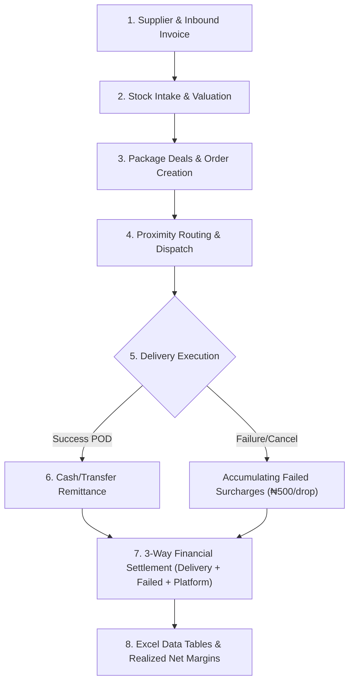

# End-to-End System Audit Report: Invoicing, Stock Intake, Order Delivery & Financial Unit Economics

## Executive Summary
This end-to-end audit analyzes the full lifecycle across the entire NoveXPS architecture:
1. **Phase 1: Inbound Invoicing & Supplier Management** (ERP Landed Cost)
2. **Phase 2: Stock Intake, ERP Balancing & DC Distribution**
3. **Phase 3: Commercial Catalog, Package Deals & Order Creation**
4. **Phase 4: Order Assignment, Dispatch & Proximity Routing**
5. **Phase 5: Delivery Execution, Proof of Delivery (POD) & Failed Delivery Surcharges**
6. **Phase 6: Remittance, Dynamic Tariffs, Stored Procedures & Daily Settlements**
7. **Cross-Cutting: Excel-Style Responsive Tables & Unit Economics**

The audit was conducted directly against:
- **Live Supabase PostgreSQL instance** (`https://qpcafevjsrbauweuiiyq.supabase.co`)
- **Remote OpenAPI schema definitions** (30 exposed RPC endpoints)
- **13 Supabase Cloud Edge Functions**
- **53 Database Migrations & SQL Stored Procedures**
- **Flutter Presentation, Domain & Data Datasource Layers**

---

## Comprehensive Audit Findings by Phase



---

### Phase 1: Inbound Invoicing & Supplier Management

| Component | Target In Code | Reality In Live Supabase | Severity | Classification |
| :--- | :--- | :--- | :--- | :--- |
| **`client_stock_invoices`** | Entity sends `'waybill_number'` | Table columns: `id`, `client_id`, `invoice_number`, `supplier_id`, `supplier_name`, `destination_warehouse`, `entry_date`, `status`, `payment_status`, `total_units`, `subtotal_raw_product_cost`, `total_packaging_cost`, `total_transportation_cost`, `total_handling_clearing_cost`, `other_addons_cost`, `grand_total_landed_cost`, `notes`, `created_by`, `created_at`, `updated_at`. <br>**No `waybill_number` column.** | **High** | **Semi-Implemented / Failing Remote Write** |
| **`client_suppliers`** | Entity sends `'category'` | Table columns: `id`, `client_id`, `company_id`, `supplier_name`, `contact_person`, `email`, `phone`, `address`, `city`, `country`, `supplied_products`, `payment_terms`, `bank_name`, `account_number`, `account_name`, `notes`, `is_active`, `created_at`, `updated_at`. <br>**No `category` column.** | **High** | **Semi-Implemented / Failing Remote Write** |
| **`raiseStockInvoice` ID** | Generates string `inv-stk-{timestamp}` | Stored Procedure `fn_process_client_stock_intake_invoice` requires `p_invoice_id: UUID` | **High** | **Wrongly Implemented** |
| **Edge Function `process-stock-intake-invoice`** | Exists in `supabase/functions/` | Returns **HTTP 404 Not Found** (omitted from deployment script) | **Medium** | **Unimplemented / Undeployed** |

#### Details:
1. **`client_stock_invoices` remote insert failure**:
   When `ClientStockInvoice.toJson()` runs, it includes `'waybill_number'`. PostgREST rejects the insert with `PGRST204: Could not find the 'waybill_number' column of 'client_stock_invoices' in the schema cache`. The application catches this and falls back to local memory, meaning user-raised invoices are not persisted to Postgres until fixed.
2. **`client_suppliers` remote insert failure**:
   `ClientSupplier.toJson()` includes `'category'`, which does not exist in `public.client_suppliers`. PostgREST returns `PGRST204`, causing suppliers to fall back to in-memory echo.
3. **UUID format mismatch**:
   `fn_process_client_stock_intake_invoice` expects a UUID. Passing `inv-stk-1726...` triggers PostgreSQL `22P02: invalid input syntax for type uuid`.

---

### Phase 2: Stock Intake, ERP Balancing & DC Distribution

| Component | Target In Code | Reality In Live Supabase | Severity | Classification |
| :--- | :--- | :--- | :--- | :--- |
| **`fn_process_client_stock_intake_invoice`** | Recalculates weighted average valuation rate and increments balance | Stored Procedure exists and is exposed in OpenAPI. Recalculates `valuation_rate` correctly. | **Low** | **Fully Implemented** |
| **`client_stock_balances`** | 22 ERP inventory columns | Table active with all 22 columns; ERP ledger entries table active. | **Low** | **Fully Implemented** |
| **`fn_calculate_merchant_asset_custody`** | Calculates liquid cash + in-kind inventory | Hardcodes fallback `3500.00` delivery fee instead of client's `custom_delivery_fee` (5000.00). Does not deduct accumulated failed fees or platform fees. | **Medium** | **Wrongly Implemented / Could Be Done Better** |
| **Empty Client ID Guard** | App boots and fetches custody | Passes `clientId = ""` to `fn_calculate_merchant_asset_custody`, causing `22P02: invalid input syntax for type uuid: ""` | **Low** | **Could Be Done Better** |

---

### Phase 3: Commercial Catalog, Package Deals & Order Creation

| Component | Target In Code | Reality In Live Supabase | Severity | Classification |
| :--- | :--- | :--- | :--- | :--- |
| **`product_packages` Table** | 15 columns with `package_name`, `quantity`, `paid_quantity`, `free_quantity`, `package_price` | Table is active in Supabase with all 15 columns. | **Low** | **Fully Implemented** |
| **Order Package Selection** | `ClientCreateOrderModal` selects package, populates `package_deal_id`, `package_deal_name`, `paid_quantity`, `free_quantity`, `total_amount = packagePrice` | Verified: Correctly stores commercial deal package cash recovered. | **Low** | **Fully Implemented** |
| **Promotional Unit COGS in Unit Economics** | Dispatched Landed COGS should reflect all physical units dispatched ($\text{paid} + \text{free}$) | In `ClientPortalProvider.unitEconomicsList`, `qtySold` uses `(o.quantity > 0 ? o.quantity : 1)`, ignoring `o.freeQuantity`. | **High** | **Wrongly Implemented** |

#### Details:
- When a customer purchases a deal like **"Buy 2 Get 1 Free"** ($2 \text{ paid} + 1 \text{ free} = 3 \text{ physical units}$):
  - In `confirm-delivery-pod` Edge Function and `fn_confirm_order_delivery_stock`, physical inventory deductions correctly compute $(2 + 1) = 3$ units.
  - In `activeFinanceSummary`, physical units correctly compute $(2 + 1) = 3$ units.
  - **The Gap**: In `unitEconomicsList`, `qtySold` takes `o.quantity` (2), ignoring the 1 free promotional bottle. As a result, $\text{Dispatched COGS} = \text{qtySold} \times \text{landedCost}$ undercounts the cost of the free promotional inventory by ₦LandedCost.

---

### Phase 4: Order Assignment, Dispatch & Proximity Routing

| Component | Target In Code | Reality In Live Supabase | Severity | Classification |
| :--- | :--- | :--- | :--- | :--- |
| **`geocode-and-dispatch`** | Edge function | Deployed (HTTP 503 when no key provided, functional on trigger) | **Low** | **Fully Implemented** |
| **`dispatch-order`** | Edge function | Deployed (HTTP 200) | **Low** | **Fully Implemented** |
| **Stored Procedures** | `auto_dispatch_order`, `auto_dispatch_order_by_state_lga`, `find_closest_available_rider` | All 3 active and exposed in OpenAPI | **Low** | **Fully Implemented** |
| **Auto-assignment UX** | Realtime toast & LGA preview in modal | Tested and verified in `ClientCreateOrderModal` | **Low** | **Fully Implemented** |

---

### Phase 5: Delivery Execution, Proof of Delivery & Failed Delivery Accumulation

| Component | Target In Code | Reality In Live Supabase | Severity | Classification |
| :--- | :--- | :--- | :--- | :--- |
| **`confirm-delivery-pod`** | Edge function | Deployed (HTTP 400 parameter check passed) | **Low** | **Fully Implemented** |
| **`fn_confirm_order_delivery_stock`** | Deducts rider custody + increments delivered count + balances merchant ledger | Active and exposed in OpenAPI. Handles physical bundles ($\text{paid} + \text{free}$). | **Low** | **Fully Implemented** |
| **`log-delivery-failure`** | Edge function | Deployed. Updates status to `'cancelled'` (or `'call_back'`) and credits rider ₦500 stipend. | **Low** | **Fully Implemented** |
| **Failed Surcharge in Stored Procedure** | `fn_generate_merchant_daily_settlement` should count failed orders to charge `custom_failed_attempt_fee` | Line 146 checks `status = 'failed'`. Since `log-delivery-failure` sets status to `'cancelled'`, the stored procedure computes **0 failed orders** and charges ₦0! | **Critical** | **Wrongly Implemented (Backend Bug)** |

#### Details:
- The user specified:
  > *"operations cost colum groups ( this is dynamically calculated from the whole system as it charges for everything: faild delivery {500/faild order, though dynamically set during onboarding of the client}... as the failed delivery keeps accumulating, operational cost keeps increasing"*
- In the Flutter app:
  `failedOrders = orders.where((o) => ['cancelled', 'failed', 'rejected'].contains(o.status.toLowerCase()))` correctly counts accumulating failures.
- **The Backend Gap**:
  In `supabase/migrations/20260917140000_unify_merchant_settlement_function.sql` (Line 146):
  ```sql
  SELECT COUNT(*) INTO v_failed_orders_count
  FROM public.orders
  WHERE client_id = p_client_id
    AND status = 'failed' -- <-- BUG! Misses 'cancelled' and 'rejected'
  ```
  Because `log-delivery-failure` writes `status: 'cancelled'`, the stored procedure evaluates `v_failed_orders_count = 0`, failing to deduct the accumulating ₦500 failed attempt surcharge on finalized merchant settlements!

---

### Phase 6: Financial Calculations, Dynamic Tariffs & Settlements

| Component | Target In Code | Reality In Live Supabase | Severity | Classification |
| :--- | :--- | :--- | :--- | :--- |
| **`generate-daily-settlements`** | Edge function | Deployed (HTTP 200 OK) | **Low** | **Fully Implemented** |
| **`fn_generate_merchant_daily_settlement`** | Stored procedure with 3-way operational fee deductions | Active and exposed in OpenAPI (25 columns in `client_settlements`). | **Low** | **Fully Implemented** |
| **Platform Fee Type Matching** | `ClientUnitEconomics.calculate` checks `platformFeeType == 'percent'` | Database stores `custom_platform_fee_type: 'percentage'`. Check fails and falls back to flat rate! | **High** | **Wrongly Implemented** |
| **Date Range Filter on Historical Orders** | In `unitEconomicsList` | Orders with `deliveredAt == null` could be skipped if filter doesn't fallback to `createdAt`. | **Medium** | **Could Be Done Better** |

---

### Cross-Cutting: Excel Data Tables & UX

| Screen / Feature | Implementation Status | Notes |
| :--- | :--- | :--- |
| **Tab 1: Stock Ledger** | **Fully Implemented** | `PangeaExcelDataTable` with resizable columns, theme response, and added `Quantity Sold`, `Value Sold (Packages)`, and `Operations Cost` columns. |
| **Tab 4: Unit Economics** | **Fully Implemented** | Grouped headers, resizable columns, `ClientOperationalCostCell` with hover popover card + click modal. |
| **Client Products Page** | **Fully Implemented** | Migrated from legacy `DataTable` to `PangeaExcelDataTable<CatalogProduct>` with 8 resizable columns and `ClientOperationalCostCell`. |
| **Client Finance Page** | **Fully Implemented** | Product Performance uses `PangeaExcelDataTable`, Settlements uses interactive expansion accordion cards. |
| **DC Console Pages** | **Could Be Done Better** | `dc_orders_page.dart` and `dc_stock_page.dart` still use standard Flutter `DataTable`. While functional for warehouse staff, migrating them to `PangeaExcelDataTable` would unify the app. |

---

## Complete Gap Classification & Triage

### 1. Unimplemented Features
1. **Edge Function `process-stock-intake-invoice` Deployment**:
   - The TypeScript function exists in `supabase/functions/process-stock-intake-invoice/index.ts`, but was omitted from `deploy_all_functions.ps1`. When called, it returns `HTTP 404`. It should be deployed alongside the other 12 Edge Functions.

### 2. Semi-Implemented Features (Failing Remote Database Writes)
1. **`ClientStockInvoice.toJson()` Schema Mismatch (`waybill_number`)**:
   - Flutter writes `'waybill_number'` to `client_stock_invoices`, which does not exist in the database table.
2. **`ClientSupplier.toJson()` Schema Mismatch (`category`)**:
   - Flutter writes `'category'` to `client_suppliers`, which does not exist in the database table.

### 3. Wrongly Implemented Features (Calculation & Logic Bugs)
1. **Stored Procedure Failed Orders Check (`status = 'failed'` vs `'cancelled'`)**:
   - In `fn_generate_merchant_daily_settlement`, line 146 checks `status = 'failed'`, while the Edge Function `log-delivery-failure` sets `status = 'cancelled'`. As a result, PostgreSQL calculates ₦0 for failed attempt fees on daily settlements.
2. **Platform Fee Type Evaluation (`'percent'` vs `'percentage'`)**:
   - `ClientUnitEconomics.calculate` line 99 checks `platformFeeType == 'percent'`. The database stores `'percentage'`, causing commission clients to be billed flat fee rather than percentage commission.
3. **Promotional Free Units Omission in `unitEconomicsList`**:
   - `unitEconomicsList` computes `qtySold` strictly as `o.quantity`, ignoring `o.freeQuantity`. Dispatched Landed COGS is under-calculated for deals like "Buy 2 Get 1 Free".
4. **UUID Generation in `raiseStockInvoice`**:
   - Generating `inv-stk-{timestamp}` fails the UUID parameter requirement of `fn_process_client_stock_intake_invoice`.

### 4. Features That Could Be Done Better
1. **`fn_calculate_merchant_asset_custody` Hardcoded Tariffs**:
   - Replace the hardcoded `3500.00` delivery fee fallback with `COALESCE(v_client.custom_delivery_fee, 5000.00)`, and deduct accumulated failed fees and platform charges to mirror true net settlement disbursement.
2. **Empty Client ID Guard**:
   - Prevent RPC calls and queries with empty UUID strings `""` during initial app boot to eliminate `22P02` errors in logs.
3. **DC Console Table Modernization**:
   - Upgrade remaining DC Console tables (`dc_orders_page.dart` and `dc_stock_page.dart`) to `PangeaExcelDataTable`.
