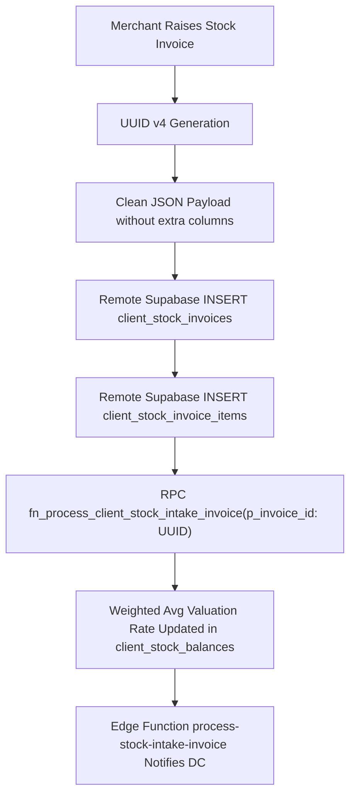

# Phase 1 Implementation Plan: Inbound Invoicing, Landed Cost & Supplier Management

## 1. Objectives & Scope
Phase 1 eliminates remote persistence failures for inbound stock invoices and merchant suppliers, fixes stored procedure parameter casting, and deploys the missing stock intake Edge Function.

---

## 2. Identified Gaps & Root Cause Analysis

1. **`client_stock_invoices` Schema Mismatch**:
   - `ClientStockInvoice.toJson()` outputs `'waybill_number'`. The live database table has no such column (`invoice_number` is used).
   - *Result*: `PostgrestException(message: Could not find the 'waybill_number' column of 'client_stock_invoices' in the schema cache, code: PGRST204)`.
2. **`client_suppliers` Schema Mismatch**:
   - `ClientSupplier.toJson()` outputs `'category'`. The live table has no such column.
   - *Result*: `PostgrestException(message: Could not find the 'category' column of 'client_suppliers' in the schema cache, code: PGRST204)`.
3. **Invalid UUID Type for Stored Procedure**:
   - `client_portal_remote_datasource.dart` generates IDs like `inv-stk-${DateTime.now().millisecondsSinceEpoch}`.
   - Stored procedure `fn_process_client_stock_intake_invoice(p_invoice_id: UUID)` fails with `invalid input syntax for type uuid`.
4. **Undeployed Edge Function**:
   - `supabase/functions/process-stock-intake-invoice` exists locally but returns 404 live.

---

## 3. Detailed Implementation Steps

### Step 1.1: Fix Entity Models & Serializers
- **File**: [`lib/features/client_portal/domain/entities/client_stock_invoice.dart`](file:///c:/PROJECT/NoveXPS/lib/features/client_portal/domain/entities/client_stock_invoice.dart)
  - Remove `'waybill_number'` from `toJson()` or map it safely into `notes` if present.
  - Ensure all keys match live table columns: `id`, `client_id`, `invoice_number`, `supplier_id`, `supplier_name`, `destination_warehouse`, `entry_date`, `status`, `payment_status`, `total_units`, `subtotal_raw_product_cost`, `total_packaging_cost`, `total_transportation_cost`, `total_handling_clearing_cost`, `other_addons_cost`, `grand_total_landed_cost`, `notes`, `created_by`.
- **File**: [`lib/features/client_portal/domain/entities/client_supplier.dart`](file:///c:/PROJECT/NoveXPS/lib/features/client_portal/domain/entities/client_supplier.dart)
  - Remove `'category'` from `toJson()`. Map category details into `supplied_products` or `notes`.
  - Ensure keys strictly align with live columns: `id`, `client_id`, `company_id`, `supplier_name`, `contact_person`, `email`, `phone`, `address`, `city`, `country`, `supplied_products`, `payment_terms`, `bank_name`, `account_number`, `account_name`, `notes`, `is_active`.

### Step 1.2: Standardize UUID Generation in Datasources
- **File**: [`lib/features/client_portal/data/datasources/client_portal_remote_datasource.dart`](file:///c:/PROJECT/NoveXPS/lib/features/client_portal/data/datasources/client_portal_remote_datasource.dart)
  - Generate canonical UUID v4 using `const Uuid().v4()` or Supabase DB default (`gen_random_uuid()`) instead of arbitrary text `inv-stk-...`.
  - Pass the verified UUID to `fn_process_client_stock_intake_invoice`.

### Step 1.3: Update Deployment Script & Deploy Edge Function
- **File**: [`supabase/deploy_all_functions.ps1`](file:///c:/PROJECT/NoveXPS/supabase/deploy_all_functions.ps1)
  - Add `"process-stock-intake-invoice"` to the `$functions` deployment array.
  - Execute deployment to remote Supabase project `qpcafevjsrbauweuiiyq`.

### Step 1.4: Dependent Features & UI Verification
- **File**: [`lib/features/client_portal/presentation/widgets/client_raise_stock_invoice_modal.dart`](file:///c:/PROJECT/NoveXPS/lib/features/client_portal/presentation/widgets/client_raise_stock_invoice_modal.dart)
  - Verify modal form creates invoice and refreshes Tab 2 (Inbound Invoices) and Tab 1 (Stock Ledger) without falling back to memory.

---

## 4. Verification & Automated Test Plan
- Unit tests in `test/client_inventory_and_landed_cost_test.dart` verifying:
  - Invoice serialization does not produce unknown schema keys.
  - Supplier serialization matches `public.client_suppliers`.
  - `fn_process_client_stock_intake_invoice` receives valid UUID.
