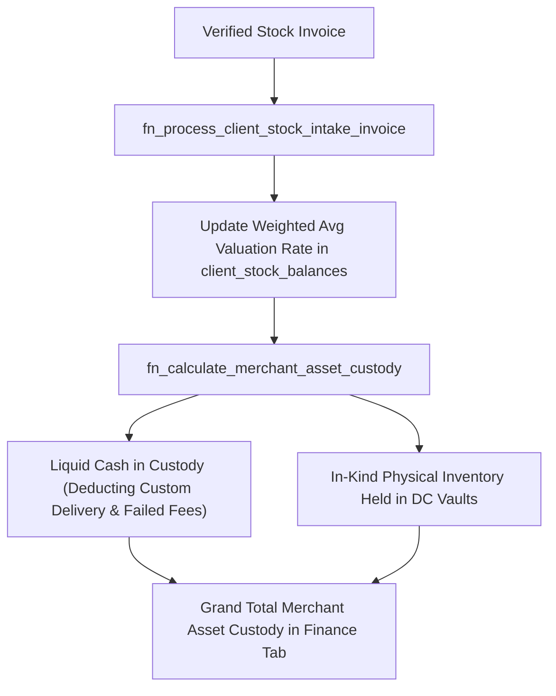

# Phase 2 Implementation Plan: Stock Intake, ERP Balancing & DC Distribution

## 1. Objectives & Scope
Phase 2 ensures that as stock is verified through inbound invoices, inventory balances automatically recalculate in the merchant ERP ledger, asset custody valuations reflect dynamic negotiated tariffs, and database queries are protected against empty UUID exceptions.



---

## 2. Identified Gaps & Root Cause Analysis

1. **Hardcoded Fallback in `fn_calculate_merchant_asset_custody`**:
   - Migration `20260915120000_financial_system_schema_and_rpc_remediation.sql` line 316 hardcodes `3500.00` fallback for `client_delivery_fee` instead of referencing `v_client.custom_delivery_fee` (5000.00 NGN).
   - It also fails to deduct accumulated failed delivery attempt fees or platform charges from the liquid cash view.
2. **Empty Client ID Exception**:
   - When the client portal boots before auth state fully resolves, `fetchMerchantAssetCustody("")` is invoked with `""`. PostgreSQL throws `22P02: invalid input syntax for type uuid: ""`.

---

## 3. Detailed Implementation Steps

### Step 2.1: Add Client ID Pre-Flight Guard
- **File**: [`lib/features/client_portal/data/datasources/client_portal_remote_datasource.dart`](file:///c:/PROJECT/NoveXPS/lib/features/client_portal/data/datasources/client_portal_remote_datasource.dart)
  - In `fetchMerchantAssetCustody(String clientId)`:
    ```dart
    if (clientId.trim().isEmpty || !RegExp(r'^[0-9a-fA-F-]{36}$').hasMatch(clientId.trim())) {
      return {'success': true, 'liquid_cash_in_custody': 0.0, 'total_inventory_units_held': 0};
    }
    ```
  - In `fetchClientSettlements(String clientId)`:
    ```dart
    if (clientId.trim().isEmpty || !RegExp(r'^[0-9a-fA-F-]{36}$').hasMatch(clientId.trim())) {
      return [];
    }
    ```

### Step 2.2: Patch Stored Procedure `fn_calculate_merchant_asset_custody`
- **File**: Create migration `supabase/migrations/20260920140000_harden_asset_custody_and_settlement_rules.sql`
  - Update `fn_calculate_merchant_asset_custody`:
    - Lookup client's negotiated `v_client.custom_delivery_fee` (defaulting to 5000.00 NGN).
    - Deduct accumulating failed delivery attempt surcharges from the liquid cash holding.
    - Grant execution permissions to `authenticated`, `service_role`, and `anon`.

### Step 2.3: Dependent Features & UI Wiring
- **File**: [`lib/features/client_portal/presentation/pages/client_finance_page.dart`](file:///c:/PROJECT/NoveXPS/lib/features/client_portal/presentation/pages/client_finance_page.dart)
  - Verify Merchant Asset Custody Ledger displays both **Baseline Landed Cost Valuation** and **Weighted Package Retail Valuation**.

---

## 4. Verification & Automated Test Plan
- Test in `test/client_finance_metrics_test.dart` verifying that empty client ID calls safely return zero balances without Postgres error logs.
