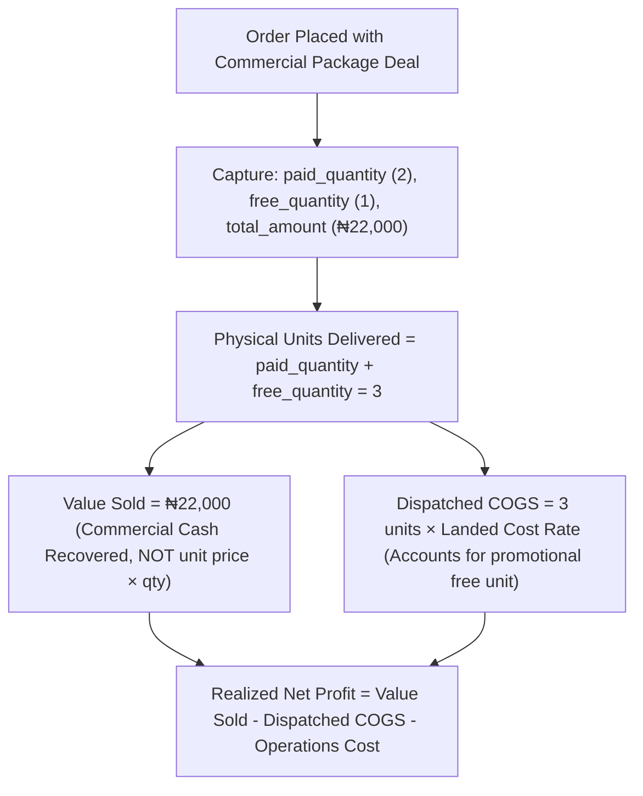

# Phase 3 Implementation Plan: Commercial Catalog, Package Deals & Order Economics

## 1. Objectives & Scope
Phase 3 harmonizes physical unit accounting for promotional deals ("Buy 2 Get 1 Free", starter packs) with commercial cash recovery. It ensures that Dispatched Landed COGS reflects the true cost of all units leaving the warehouse, while Value Sold remains strictly the cash collected from package sales.



---

## 2. Identified Gaps & Root Cause Analysis

1. **Promotional Free Units Omitted from `qtySold` in Unit Economics**:
   - In [`client_portal_provider.dart:L407`](file:///c:/PROJECT/NoveXPS/lib/features/client_portal/presentation/providers/client_portal_provider.dart#L407):
     ```dart
     final int qtySold = deliveredOrders.fold<int>(
       0,
       (sum, o) => sum + (o.quantity > 0 ? o.quantity : 1),
     );
     ```
   - For a "Buy 2 Get 1 Free" order, `o.quantity` is 2, while `o.freeQuantity` is 1. The code calculates `qtySold = 2`, ignoring the 1 free promotional bottle.
   - *Result*: `cogsDispatched = qtySold * totalLandedCost` under-calculates the cost of goods sold, inflating reported net margin.
2. **Platform Fee Type String Matching**:
   - In [`client_unit_economics.dart:L99`](file:///c:/PROJECT/NoveXPS/lib/features/client_portal/domain/entities/client_unit_economics.dart#L99):
     `platformFeeType == 'percent'` fails when the database stores `'percentage'`, falling back to flat fee.

---

## 3. Detailed Implementation Steps

### Step 3.1: Update Unit Economics Quantity Sold Calculation
- **File**: [`lib/features/client_portal/presentation/providers/client_portal_provider.dart`](file:///c:/PROJECT/NoveXPS/lib/features/client_portal/presentation/providers/client_portal_provider.dart)
  - Refactor `qtySold` to evaluate true physical units across package deals:
    ```dart
    final int qtySold = deliveredOrders.fold<int>(
      0,
      (sum, o) {
        final bundleUnits = o.paidQuantity + o.freeQuantity;
        return sum + (bundleUnits > 0 ? bundleUnits : (o.quantity > 0 ? o.quantity : 1));
      },
    );
    ```

### Step 3.2: Harmonize Platform Fee Type Matching
- **File**: [`lib/features/client_portal/domain/entities/client_unit_economics.dart`](file:///c:/PROJECT/NoveXPS/lib/features/client_portal/domain/entities/client_unit_economics.dart)
  - Update `platformCharges` formula:
    ```dart
    final isPercent = platformFeeType.toLowerCase().startsWith('percent');
    final platformCharges = isPercent
        ? (valueSold * (platformChargeRate / 100.0))
        : (deliveredOrdersCount * platformChargeRate);
    ```

### Step 3.3: Dependent Features & Screen Verification
- **File**: [`lib/features/client_portal/presentation/pages/client_inventory_page.dart`](file:///c:/PROJECT/NoveXPS/lib/features/client_portal/presentation/pages/client_inventory_page.dart)
  - Verify Tab 1 (Stock Ledger) and Tab 4 (Unit Economics) display the correct physical unit count and package cash recovered.
- **File**: [`lib/features/client_portal/presentation/pages/client_products_page.dart`](file:///c:/PROJECT/NoveXPS/lib/features/client_portal/presentation/pages/client_products_page.dart)
  - Verify `PangeaExcelDataTable` Quantity Sold and Value Sold columns accurately display package bundle results.

---

## 4. Verification & Automated Test Plan
- Update `test/pangea_excel_and_operational_economics_test.dart`:
  - Add test case verifying an order with `paidQuantity: 2, freeQuantity: 1` produces `quantitySold: 3` and calculates Landed COGS for 3 units.
  - Verify `custom_platform_fee_type: 'percentage'` applies percentage commission on Value Sold.
