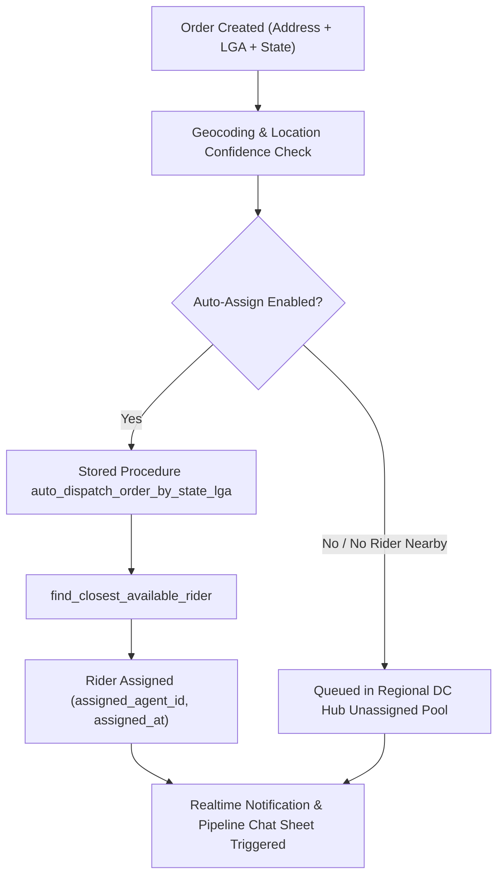

# Phase 4 Implementation Plan: Order Assignment, Dispatch & Proximity Routing

## 1. Objectives & Scope
Phase 4 audits and ensures that orders created via single order modal or bulk CSV upload are automatically geocoded, mapped to regional LGA boundaries, assigned to the optimal Distribution Center (DC Hub), and dispatched either directly to available riders or queued in the DC pool.

---

## 2. Architecture & Service Verification

1. **Active Stored Procedures**:
   - `public.auto_dispatch_order_by_state_lga(p_order_id, p_state, p_lga)`
   - `public.find_closest_available_rider(p_dc_id, p_lat, p_lng, p_radius_km)`
   - `public.update_rider_gps_telemetry(p_rider_id, p_lat, p_lng, p_battery, p_status)`
2. **Active Edge Functions**:
   - `geocode-and-dispatch`: Evaluates address strings against Nigerian geographic bounds.
   - `dispatch-order`: Handles supervisory manual assignments and re-assignments.

---

## 3. Detailed Implementation Steps

### Step 4.1: Fallback LGA & State Scoping Hardening
- **File**: [`lib/features/orders/domain/services/order_routing_service.dart`](file:///c:/PROJECT/NoveXPS/lib/features/orders/domain/services/order_routing_service.dart)
  - Ensure location lookups for AMAC, Bwari, Gwagwalada, Ikeja, Lekki, and other regional LGAs map directly to active DC hubs without `null` distribution center IDs.
  - Maintain historical `sourceWarehouse` attribution on `orders` for merchant stock ledger alignment.

### Step 4.2: Realtime UI Feedback & Pipeline Chat Sheet
- **File**: [`lib/features/client_portal/presentation/widgets/client_order_tracking_modal.dart`](file:///c:/PROJECT/NoveXPS/lib/features/client_portal/presentation/widgets/client_order_tracking_modal.dart)
  - Display live dispatch status: Assigned Rider Name, Station Contact Phone, Live Telemetry Status, and Pipeline Chat action button.

---

## 4. Verification & Automated Test Plan
- Verify tests in `test/backend_geocoding_and_proximity_dispatch_test.dart` and `test/order_routing_and_lga_dispatch_test.dart`.
