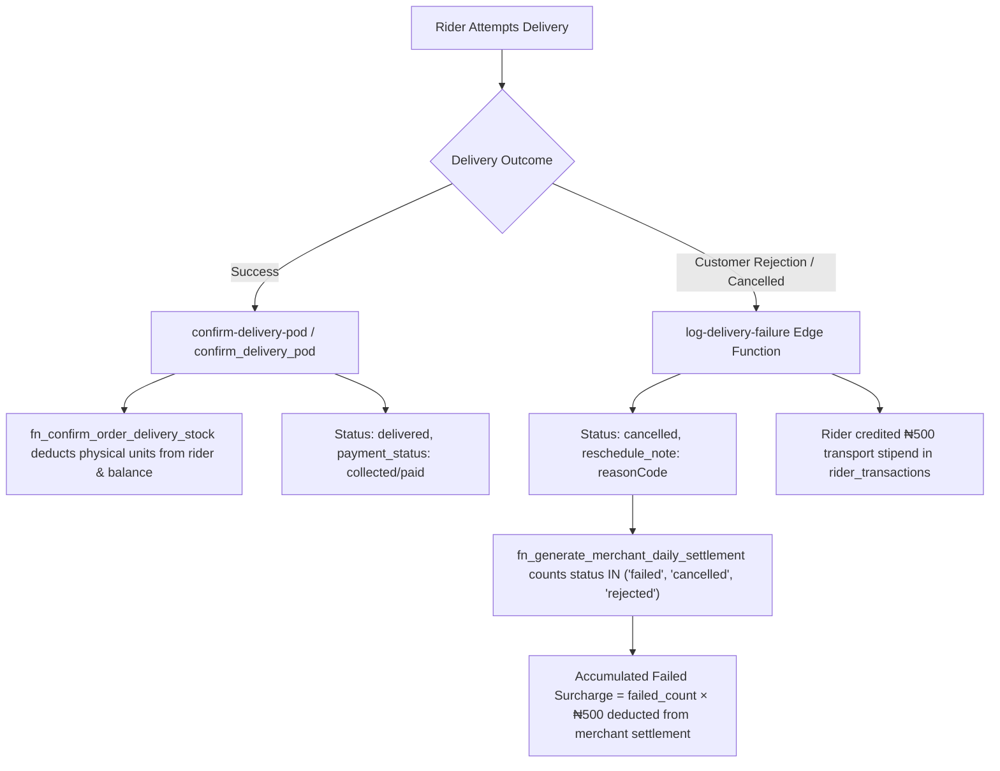

# Phase 5 Implementation Plan: Delivery Execution, POD & Failed Delivery Accumulation

## 1. Objectives & Scope
Phase 5 addresses the critical gap where accumulating failed delivery attempt surcharges (₦500/failed order) were failing to deduct during daily settlements due to a status string mismatch between the Edge Function and the stored procedure.



---

## 2. Identified Gaps & Root Cause Analysis

1. **Stored Procedure Status Mismatch in `fn_generate_merchant_daily_settlement`**:
   - In [`supabase/migrations/20260917140000_unify_merchant_settlement_function.sql:L146`](file:///c:/PROJECT/NoveXPS/supabase/migrations/20260917140000_unify_merchant_settlement_function.sql#L146):
     ```sql
     SELECT COUNT(*) INTO v_failed_orders_count
     FROM public.orders
     WHERE client_id = p_client_id
       AND status = 'failed'
     ```
   - In [`supabase/functions/log-delivery-failure/index.ts:L38`](file:///c:/PROJECT/NoveXPS/supabase/functions/log-delivery-failure/index.ts#L38):
     `const newStatus = isCallback ? "call_back" : "cancelled";`
   - Because `log-delivery-failure` writes `'cancelled'`, the stored procedure evaluates `v_failed_orders_count = 0`.
   - *Result*: The client is never charged the accumulating ₦500/failed attempt fee in finalized database settlement records, violating commercial agreements.

---

## 3. Detailed Implementation Steps

### Step 5.1: Create SQL Migration for `fn_generate_merchant_daily_settlement`
- **File**: `supabase/migrations/20260920140000_harden_asset_custody_and_settlement_rules.sql`
  - Update `fn_generate_merchant_daily_settlement` line 146:
    ```sql
    SELECT COUNT(*) INTO v_failed_orders_count
    FROM public.orders
    WHERE client_id = p_client_id
      AND status IN ('failed', 'cancelled', 'rejected', 'customer_rejected')
      AND (v_eff_period_start IS NULL OR (COALESCE(delivered_at, created_at) >= v_eff_period_start))
      AND (COALESCE(delivered_at, created_at) <= v_eff_period_end);
    ```
  - Apply this function update to the live Supabase PostgreSQL database.

### Step 5.2: Harmonize Flutter Client Portal Status Filter
- **File**: [`lib/features/client_portal/presentation/providers/client_portal_provider.dart`](file:///c:/PROJECT/NoveXPS/lib/features/client_portal/presentation/providers/client_portal_provider.dart)
  - Ensure all failed order counting checks consistently evaluate:
    ```dart
    bool isOrderFailed(OrderEntity o) {
      final s = o.status.toLowerCase();
      return s == 'failed' || s == 'cancelled' || s == 'rejected' || s == 'customer_rejected';
    }
    ```

### Step 5.3: Dependent Features & UI Modal Verification
- **File**: [`lib/features/client_portal/presentation/widgets/client_operational_cost_breakdown_modal.dart`](file:///c:/PROJECT/NoveXPS/lib/features/client_portal/presentation/widgets/client_operational_cost_breakdown_modal.dart)
  - Verify that the modal's **Failed Delivery Attempt Charges** card correctly displays:
    `"${economics.failedOrdersCount} failed/cancelled orders @ ₦${currency.format(economics.failedFeeRate)} per attempt"`
    and matches the accumulated fee in the primary column.

---

## 4. Verification & Automated Test Plan
- Run automated tests in `test/negotiated_operational_charges_test.dart` and `test/pangea_excel_and_operational_economics_test.dart` asserting that failed orders accumulating from 1 to 6 dynamically increase total operations cost.
