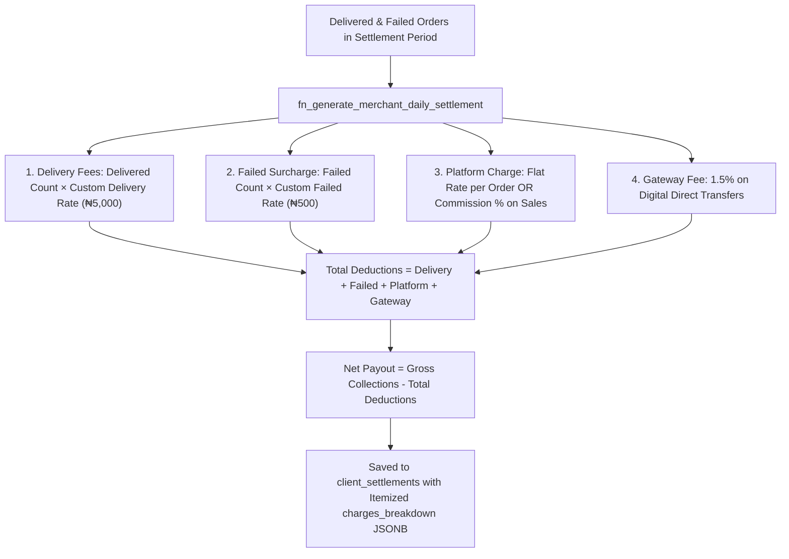

# Phase 6 Implementation Plan: Financial Calculations, Tariffs & Daily Settlements

## 1. Objectives & Scope
Phase 6 guarantees mathematical parity between the Flutter client portal's unit economics calculations, the Edge Function automated closeout jobs, and the Supabase stored procedures executing daily client settlements.



---

## 2. Identified Gaps & Root Cause Analysis

1. **Platform Fee Type Mismatch**:
   - `ClientUnitEconomics.calculate` line 99 checks `platformFeeType == 'percent'`, while DB stores `'percentage'`. Percentage clients receive flat ₦2.5 fee instead of 2.5% commission on package cash.
2. **Date Range Fallback for Historical Orders**:
   - Historical delivered orders with `delivered_at: null` are excluded if the date filter only checks `deliveredAt`.
3. **Empty Client ID Queries**:
   - Querying `client_settlements` with empty string `""` produces PostgREST `22P02`.

---

## 3. Detailed Implementation Steps

### Step 6.1: Harmonize Platform Tariff Evaluation
- **File**: [`lib/features/client_portal/domain/entities/client_unit_economics.dart`](file:///c:/PROJECT/NoveXPS/lib/features/client_portal/domain/entities/client_unit_economics.dart)
  - Ensure `'percent'` and `'percentage'` both trigger percentage calculation:
    ```dart
    final isPercent = platformFeeType.toLowerCase().startsWith('percent');
    final platformCharges = isPercent
        ? (valueSold * (platformChargeRate / 100.0))
        : (deliveredOrdersCount * platformChargeRate);
    ```

### Step 6.2: Add Date Fallback to Unit Economics Date Filtering
- **File**: [`lib/features/client_portal/presentation/providers/client_portal_provider.dart`](file:///c:/PROJECT/NoveXPS/lib/features/client_portal/presentation/providers/client_portal_provider.dart)
  - In `unitEconomicsList`:
    ```dart
    if (inventoryStartDate != null || inventoryEndDate != null) {
      final dt = (o.deliveredAt ?? o.createdAt).toLocal();
      if (inventoryStartDate != null && dt.isBefore(inventoryStartDate!)) return false;
      if (inventoryEndDate != null) {
        final endOfDay = DateTime(inventoryEndDate!.year, inventoryEndDate!.month, inventoryEndDate!.day, 23, 59, 59);
        if (dt.isAfter(endOfDay)) return false;
      }
    }
    ```

### Step 6.3: Guard Settlement Queries in Remote Datasource
- **File**: [`lib/features/client_portal/data/datasources/client_portal_remote_datasource.dart`](file:///c:/PROJECT/NoveXPS/lib/features/client_portal/data/datasources/client_portal_remote_datasource.dart)
  - In `fetchClientSettlements(String clientId)`:
    ```dart
    if (clientId.trim().isEmpty || !RegExp(r'^[0-9a-fA-F-]{36}$').hasMatch(clientId.trim())) {
      return [];
    }
    ```

---

## 4. Verification & Automated Test Plan
- Run automated tests in `test/negotiated_operational_charges_test.dart` and `test/pangea_excel_and_operational_economics_test.dart`.
