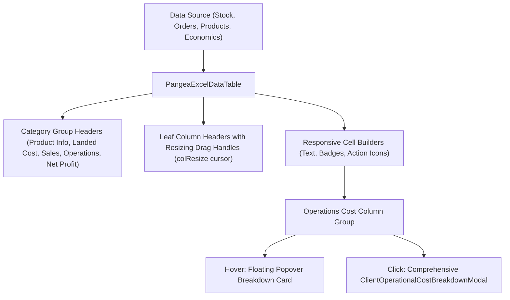

# Phase 7 Implementation Plan: Excel-Style Data Tables, Responsiveness & UX

## 1. Objectives & Scope
Phase 7 standardizes all data presentation tables across the NoveXPS platform into Excel-style interactive data tables featuring interactive column resizing, multi-tier group headers, theme responsiveness (light and dark mode), per-column inline searching, and embedded operational drill-down modals.

---

## 2. Table Modernization Matrix

| Screen | Table Type | Current Status | Planned Action |
| :--- | :--- | :--- | :--- |
| **`ClientInventoryPage` (Tab 1: Stock Ledger)** | `PangeaExcelDataTable<ClientStockBalance>` | Modernized with Quantity Sold, Value Sold, and Operations Cost | Verified & Completed |
| **`ClientInventoryPage` (Tab 4: Unit Economics)** | `PangeaExcelDataTable<ClientUnitEconomics>` | Modernized with grouped headers & `ClientOperationalCostCell` | Verified & Completed |
| **`ClientProductsPage`** | `PangeaExcelDataTable<CatalogProduct>` | Modernized with 8 resizable columns & `ClientOperationalCostCell` | Verified & Completed |
| **`ClientFinancePage`** | `PangeaExcelDataTable<ClientProductFinanceSummary>` | Modernized with resizable columns | Verified & Completed |
| **`ClientOrdersPage`** | Custom `ListView.separated` Row Table | Functional desktop row list | Migrate desktop view to `PangeaExcelDataTable<OrderEntity>` |
| **`dc_orders_page.dart`** | Legacy Flutter `DataTable` | Functional standard table | Plan migration to `PangeaExcelDataTable` for DC staff |
| **`dc_stock_page.dart`** | Legacy Flutter `DataTable` | Functional standard table | Plan migration to `PangeaExcelDataTable` for DC staff |

---

## 3. Detailed Implementation Steps

### Step 3.1: Upgrade `ClientOrdersPage` Desktop Table to `PangeaExcelDataTable`
- **File**: [`lib/features/client_portal/presentation/pages/client_orders_page.dart`](file:///c:/PROJECT/NoveXPS/lib/features/client_portal/presentation/pages/client_orders_page.dart)
  - Define `ExcelColumnDef<OrderEntity>` list:
    1. `ORDER # & DATE` (Group: Order Identification, defaultWidth: 160)
    2. `CUSTOMER NAME` (Group: Recipient Details, defaultWidth: 160)
    3. `PHONE & DESTINATION` (Group: Recipient Details, defaultWidth: 180)
    4. `PRODUCT & PACKAGE DEAL` (Group: Package & Deal Details, defaultWidth: 200)
    5. `QTY` (Group: Package & Deal Details, defaultWidth: 80, align: center)
    6. `VALUE RECOVERED (TOTAL AMOUNT)` (Group: Package & Deal Details, defaultWidth: 150, align: right)
    7. `FULFILLMENT HUB & AGENT` (Group: Fulfillment, defaultWidth: 180)
    8. `PAYMENT & STATUS` (Group: Fulfillment, defaultWidth: 140)
    9. `ACTIONS` (Group: Actions, defaultWidth: 100)
  - Replace desktop `ListView.separated` with `PangeaExcelDataTable<OrderEntity>`.

### Step 3.2: Polish Popover Positioning & Overlay Behavior
- **File**: [`lib/features/client_portal/presentation/widgets/client_operational_cost_breakdown_modal.dart`](file:///c:/PROJECT/NoveXPS/lib/features/client_portal/presentation/widgets/client_operational_cost_breakdown_modal.dart)
  - Ensure overlay follower anchors dynamically adjust when cells are near the right viewport boundary to prevent off-screen clipping.

---

## 4. Verification & Automated Test Plan
- Run `test/client_excel_table_test.dart` and `test/pangea_excel_and_operational_economics_test.dart`.
- Verify `ClientOrdersPage` tests in `test/client_order_tracking_modal_test.dart` pass with the upgraded Excel table.
