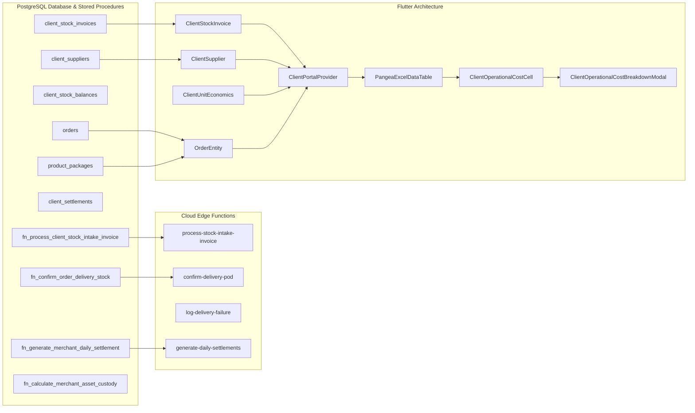

# Master Cross-Phase Dependency & Verification Matrix

## 1. Executive Dependency Architecture

This matrix documents all cross-cutting dependencies connecting the database schema, stored procedures, Edge Functions, data models, providers, UI widgets, and test suites across all 7 phases.

---

## 2. Cross-Phase Dependency Mapping Table

| Phase | Core Asset | Dependent Components | Impact if Inconsistent | Remediation |
| :--- | :--- | :--- | :--- | :--- |
| **Phase 1** | `client_stock_invoices` | `ClientStockInvoice.toJson()`, `raiseStockInvoice()`, `fn_process_client_stock_intake_invoice` | Inserting `'waybill_number'` crashes with `PGRST204` | Remove `'waybill_number'` from payload; use UUID v4 for invoice ID |
| **Phase 1** | `client_suppliers` | `ClientSupplier.toJson()`, `createSupplier()` | Inserting `'category'` crashes with `PGRST204` | Remove `'category'` from payload |
| **Phase 1** | `process-stock-intake-invoice` | `deploy_all_functions.ps1`, Supabase CLI | Function returns 404 live | Add to deploy script and deploy to Supabase |
| **Phase 2** | `fn_calculate_merchant_asset_custody` | `clients.custom_delivery_fee`, `client_finance_page.dart` | Asset valuation uses hardcoded ₦3,500 fallback | Patch stored procedure to reference `custom_delivery_fee` and deduct failed surcharges |
| **Phase 3** | `unitEconomicsList` | `orders.paid_quantity`, `orders.free_quantity`, `ClientUnitEconomics.calculate` | Ignoring `free_quantity` under-calculates Dispatched COGS | Update `qtySold` to $(paid + free)$ physical units |
| **Phase 3** | `ClientUnitEconomics` | `clients.custom_platform_fee_type` | `'percentage'` check fails if checking `'percent'` | Allow `'percentage'` and `'percent'` interchangeably |
| **Phase 5** | `fn_generate_merchant_daily_settlement` | `orders.status`, `log-delivery-failure` | Stored procedure checks `status = 'failed'`, missing `'cancelled'` | Patch SQL line 146 to check `status IN ('failed', 'cancelled', 'rejected')` |
| **Phase 6** | `client_settlements` | `generate-daily-settlements`, `fetchClientSettlements` | Empty client ID crashes with `22P02` | Guard datasource against empty UUID strings |
| **Phase 7** | `PangeaExcelDataTable` | `ClientOrdersPage`, `ClientInventoryPage`, `ClientProductsPage` | Non-unified UI layout | Upgrade all desktop tables to `PangeaExcelDataTable` |

---

## 3. Holistic Automated Test Suite Verification

Every fix implemented across any phase must be validated against the comprehensive test matrix:
1. `test/pangea_excel_and_operational_economics_test.dart` (Unit economics, promotional bundles, hover popover, modal drilldown, date filtering)
2. `test/client_excel_table_test.dart` (Excel table column resizing, search filtering, theme response)
3. `test/negotiated_operational_charges_test.dart` (Custom onboarding tariffs, 3-way operational fee deductions)
4. `test/client_inventory_and_landed_cost_test.dart` (Inbound stock invoices, ERP stock ledger)
5. `test/client_order_tracking_modal_test.dart` (Orders table click to open tracking modal)
6. `flutter analyze` (Zero errors, warnings, or lints across all project files)
