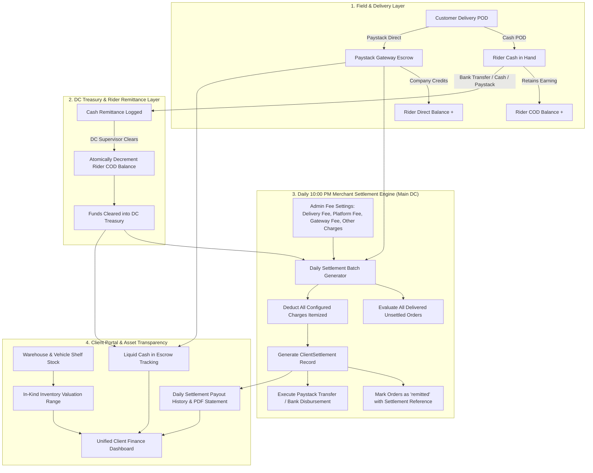

# Comprehensive Financial Ecosystem Audit Report: NoveXPS Logistics Platform

**Audited Domains**: Direct Payments, Cash & Digital Remittance, Rider Payouts & Compensation, Merchant Billing & 10:00 PM Daily Settlement, Cash vs. In-Kind Asset Custody  
**Inspection Scope**: PostgreSQL Schemas & Foreign Keys, Stored Procedures & Triggers, Supabase Edge Functions & Webhooks, Flutter Providers & Data Sources, Local Storage Caching  
**Date**: September 13, 2026  

---

## Executive Summary

A comprehensive, end-to-end architectural audit of the entire financial ecosystem of NoveXPS was performed. The platform's financial pipeline connects four major stakeholders:
1. **The Customer / Recipient** (paying via Cash on Delivery, Direct Bank Transfer, or Paystack Dynamic Virtual Account).
2. **The Delivery Agent / Rider** (holding collected COD cash, earning delivery commission and transport allowance, and maintaining withdrawable "My Balance" for direct transfer orders).
3. **The Distribution Center (DC)** (receiving physical/digital remittances, approving rider payouts, managing station treasury, and executing client settlements).
4. **The Client / Merchant** (entitled to gross delivered collections minus logistics delivery fees, platform commissions, payment gateway fees, and auxiliary order charges).

While the foundational schema supports individual transactions, this audit identified **12 critical architectural flaws, schema mismatches, missing stored procedures, and missing business workflows** that prevent reliable end-to-end financial operations.

---

## 1. Matrix of Audit Findings Across All Architecture Layers

| # | Subsystem / Feature | Severity | Finding / Root Cause | Impact |
| :- | :--- | :--- | :--- | :--- |
| **1** | **Rider Payout Requests** | 🔴 **CRITICAL** | `FinanceRemoteDataSourceImpl.requestPayout` inserts into non-existent table `'payout_claims'` instead of authoritative `'payout_requests'`. | Riders cannot request balance withdrawals. App falls back to offline stub. |
| **2** | **DC Payout Approval RPC** | 🔴 **CRITICAL** | `DCConsoleRemoteDataSource.approvePayoutClaim` calls RPC `decrement_driver_entitlement`, which does not exist in PostgreSQL. | Rider's withdrawable balance is never decremented when payout is approved. Double-withdrawal risk. |
| **3** | **COD Balance Deductions** | 🔴 **CRITICAL** | Approving a cash remittance (`cash_remittances`) does not decrement `delivery_agents.current_cod_balance`. | Rider COD debt accumulates indefinitely even after turning in cash to DC or paying via Paystack. |
| **4** | **10:00 PM Client Settlement Engine** | 🔴 **CRITICAL** | No automated or manual batch engine exists in DC Console to generate daily client settlements from delivered orders. | Clients cannot receive their daily revenue closeout; `client_settlements` is only read with historical seed data. |
| **5** | **Configurable Order Charges** | 🟠 **HIGH** | `dc_finance_settings` only holds POS and rider fees. Platform service fees, merchant delivery fees, and custom order charges are hardcoded or absent. | Admins cannot set or modify platform commissions or custom fees per order or per client. |
| **6** | **Cash vs. In-Kind Valuation** | 🟠 **HIGH** | No unified calculation of client liquid funds (Paystack/Escrow) vs in-kind inventory (shelf stock & rider vehicle custody) with package pricing estimation. | Clients lack transparency into total company-held assets and inventory liquidation value. |
| **7** | **Failed Delivery Stipends** | 🟠 **HIGH** | Edge function `log-delivery-failure` updates order status to `cancelled`/`call_back` but never credits the rider's `failed_delivery_allowance` (₦500). Column `failed_stipends_deducted` missing from `cash_remittances`. | Riders are not compensated for failed delivery attempts; remittance deduction fails on schema. |
| **8** | **Paystack Direct Delivery Fee Deduction** | 🟡 **MEDIUM** | `ClientProductFinanceSummary.calculate` sets `feeToDeduct = 0.0` for direct transfer orders (`isDirectTransfer ? 0.0 : clientDeliveryFee`). | Platform loses delivery fee revenue on prepaid / direct Paystack orders. |
| **9** | **Hardcoded DC Fallback in Finance** | 🟡 **MEDIUM** | `dc_remittance_detail_modal.dart` and `paystack-webhook/index.ts` hardcode fallback DC UUID `22222222-2222-4222-8222-222222222222`. | Regional DC remittances incorrectly route to Wuse Central DC. |
| **10** | **Remittance Reference Auto-Generation** | 🟡 **MEDIUM** | Edge function `submit-cash-remittance` inserts into `cash_remittances` without generating `reference_number`, violating UNIQUE NOT NULL constraint. | API requests to edge function fail on PostgreSQL constraint. |
| **11** | **Client Settlement Breakdown Columns** | 🟡 **MEDIUM** | `client_settlements` table only has `gross_collections`, `logistics_fees_deducted`, and `net_payout_amount`. Missing itemized platform fee, gateway fee, and failed attempt deductions. | Lacks line-item auditability required for merchant trust. |
| **12** | **Rider Entitlement on Direct POD** | 🟢 **LOW** | `confirm-delivery-pod` edge function hardcodes default entitlements (`500/1000` commission, `800/1500` transport) instead of querying active `dc_finance_settings`. | Custom DC finance overrides are ignored during POD. |

---

## 2. In-Depth Component Analysis

### 2.1 Rider Payout & Earnings Pipeline
- **Rider Balance Types**:
  - `current_cod_balance`: Physical cash in rider custody from Pay-on-Delivery collections. **Rider owes this to the company.**
  - `direct_transfer_balance` ("My Balance"): Commission and transport allowance credited to the rider when customers pay directly to the company bank / Paystack. **Company owes this to the rider.**
- **The Payout Bug**:
  - In `lib/features/finance/data/datasources/finance_remote_datasource.dart:310`:
    ```dart
    final response = await dbClient.from('payout_claims').insert({ ... });
    ```
  - The actual table in Supabase is `payout_requests` (`supabase/migrations/20260819180000_full_schema_pda_system.sql:388`).
  - Furthermore, `payout_requests` requires `payout_number VARCHAR(100) UNIQUE NOT NULL`, but `finance_remote_datasource.dart` does not supply one.
  - In `lib/features/dc_console/data/datasources/dc_console_remote_datasource.dart:469`, when the DC supervisor approves a payout:
    ```dart
    await adminDb.rpc('decrement_driver_entitlement', params: {
      'p_driver_id': driverId,
      'p_amount': amount,
    });
    ```
  - Stored procedure `decrement_driver_entitlement` **does not exist anywhere in Supabase migrations**. As a result, the RPC call throws an error, the `catch` block silently swallows it, and the rider's `direct_transfer_balance` remains untouched.

### 2.2 Cash Remittance & COD Debt Liquidation
- When an order is delivered with Cash POD:
  - Rider collects `order.total_amount` (e.g. ₦35,000).
  - Rider retains commission (e.g. ₦1,000), transport (e.g. ₦1,500), and transfer charge (e.g. ₦700).
  - Net to remit = ₦31,800.
  - `delivery_agents.current_cod_balance` increases by ₦31,800.
- When rider remits cash to DC (or pays via Paystack instant transfer):
  - Record created in `cash_remittances`.
  - In `dc_remittance_detail_modal.dart`, DC supervisor clicks **"Confirm & Clear"**.
  - **The Gap**: The remittance status updates to `verified`, but **no SQL trigger or procedure decrements `delivery_agents.current_cod_balance`**. The rider's COD liability is never cleared in the database.

### 2.3 The 10:00 PM Daily Merchant Settlement Closeout (The New Core Feature)
- **The Business Need**:
  - Every day by **10:00 PM**, merchants/clients want their net money from all orders delivered during the day.
  - The Main Grand DC Console (operating as the central financial clearinghouse) must execute or automate this closeout.
  - Calculations must deduct:
    1. **Logistics Delivery Fee** (e.g. ₦3,000 intra-state, ₦5,000 inter-state, or client negotiated rate).
    2. **Platform Commission / Service Fee** (configurable flat fee or % of GMV).
    3. **Payment Gateway Processing Fees** (Paystack direct transfer charges absorbed by merchant or company).
    4. **Failed Delivery Stipends** (if client covers rider attempt fees on failed deliveries).
    5. **Other / Auxiliary Charges** (warehousing, packaging, handling).
- **Naming Conventions**:
  - **Main DC Console**: **"Daily Merchant Settlement (10:00 PM Closeout)"** / **"Client Payout Ledger"**.
  - **Client Portal**: **"Daily Settlements & Payouts"** / **"Net Remittance Statements"**.
- **Current State**:
  - `client_settlements` table was created in migration `20260911130000_client_financial_settlements_and_order_columns.sql`.
  - Only one static seed record exists (`SETTLE-NOV-2026-001`).
  - There is **zero functionality** in DC Console or backend to create, preview, calculate, or approve daily settlements.

### 2.4 Cash Held (Liquid) vs. In-Kind Asset (Inventory) Custody
- Merchants need visibility into their complete balance sheet within NovaXpress:
  1. **Liquid Cash in Custody**:
     - **Paystack Direct Escrow**: Cash collected via Paystack virtual accounts for delivered orders awaiting 10 PM payout.
     - **DC Vault / Cash on Hand**: Cash remitted by riders to DC for client orders awaiting bank transfer.
  2. **In-Kind Asset Holdings (Product Inventory)**:
     - Total physical units in warehouse custody (`products.stock_quantity`) and in rider vehicle custody (`agent_inventory.available_count`).
     - **Valuation Estimation**:
       - Base Inventory Value: `Total Units × Product.base_price`.
       - Estimated Realizable Revenue: Taking package deals into account (e.g. 1 bottle @ ₦25,000 vs 2 bottles @ ₦40,000 vs 3 bottles @ ₦50,000). A weighted historical average unit price provides an accurate estimated asset valuation range.

---

## 3. Remediated Architecture Blueprint



---

## 4. Key Recommendations & Action Items

1. **Fix Table Discrepancy**: Standardize on `payout_requests` across `FinanceRemoteDataSourceImpl` and `DCConsoleRemoteDataSourceImpl`.
2. **Create Stored Procedures**:
   - `decrement_driver_entitlement(p_driver_id UUID, p_amount NUMERIC)`
   - `fn_approve_cash_remittance(p_remittance_id UUID, p_supervisor_id UUID)`
   - `fn_generate_merchant_daily_settlement(p_client_id UUID, p_dc_id UUID, p_period_start TIMESTAMPTZ, p_period_end TIMESTAMPTZ, p_custom_deductions JSONB)`
3. **Expand `dc_finance_settings` and `clients`**:
   - Add platform service fee (flat / %), merchant delivery fee default, gateway fee handling, and failed attempt fee.
   - Allow per-client overrides.
4. **Implement Main DC Settlement Console**:
   - Add a dedicated **"Daily Merchant Settlement (10:00 PM Closeout)"** module in DC Console.
   - Provide interactive preview of eligible delivered orders, live deduction breakdown, and batch execution button.
5. **Implement Client Asset Portfolio Card**:
   - Display Liquid Cash in Escrow vs In-Kind Inventory Valuation (Base Price & Package-Weighted Realizable Value).
