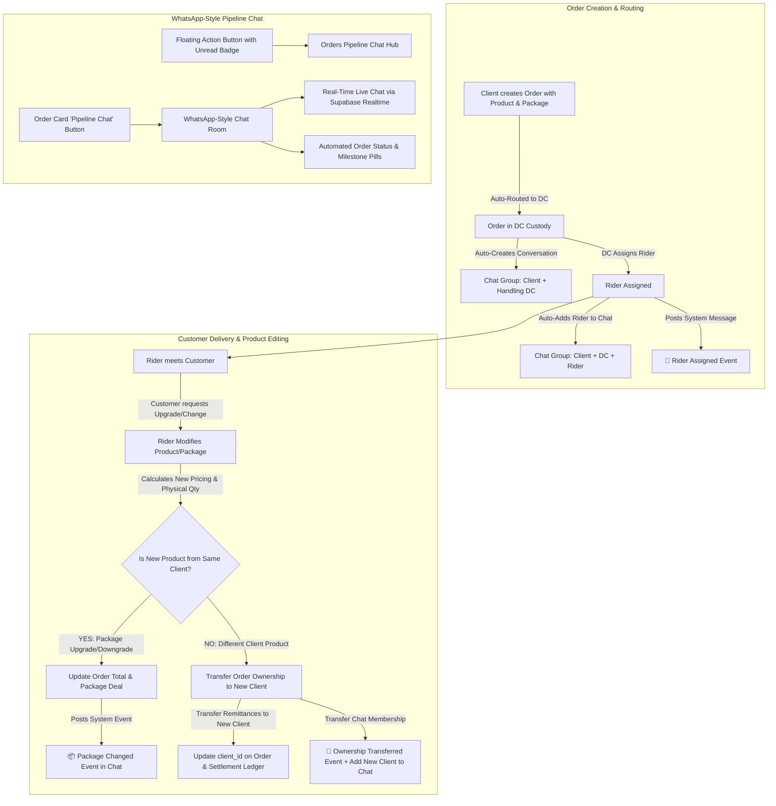

# Implementation Plan: Client Multi-Tenancy, DC Asset Management, Rider Product/Package Editing, Ownership Transfer & In-App Instant Messaging

A holistic, end-to-end implementation plan resolving all audit findings ([docs/audit_report.md](file:///c:/PROJECT/NoveXPS/docs/audit_report.md)) and incorporating:
1. **Rider Order Product & Package Editing** (upgrade/downgrade/switch product on customer impulse).
2. **Dynamic Order Ownership Transfer** (reassigning order and remittances to the new client if product is changed).
3. **In-App WhatsApp-Style Instant Messaging** (order pipeline group chat between Client, DC, and Rider with Floating Action Button, real-time sync, and automated event messages).
4. **Strict Client Multi-Tenancy & Autonomous Package Management**.
5. **DC Console Individual Client Asset Management Console & Routing Optimization**.
6. **Zero-Hardcoding Eradication across all 19 cataloged files**.

> [!TIP]
> **Modular Implementation Plan Documents**:
> For deep-dive tracking across every tier, detailed architectural plans are separated into modular documents inside [**docs/plans/**](file:///c:/PROJECT/NoveXPS/docs/plans):
> - [00_MASTER_BLUEPRINT.md](file:///c:/PROJECT/NoveXPS/docs/plans/00_MASTER_BLUEPRINT.md): System architecture, cross-system dependency map, data flow diagram, tenant boundaries.
> - [01_SUPABASE_SCHEMA_AND_MIGRATIONS.md](file:///c:/PROJECT/NoveXPS/docs/plans/01_SUPABASE_SCHEMA_AND_MIGRATIONS.md): DDL for conversations, messages, column alterations, indexes, and realtime publication.
> - [02_STORED_PROCEDURES_AND_TRIGGERS.md](file:///c:/PROJECT/NoveXPS/docs/plans/02_STORED_PROCEDURES_AND_TRIGGERS.md): Automatic conversation syncing triggers, status milestone broadcasts, and atomic ownership transfer procedure.
> - [03_DATA_SOURCES_AND_ZERO_HARDCODING_SWEEP.md](file:///c:/PROJECT/NoveXPS/docs/plans/03_DATA_SOURCES_AND_ZERO_HARDCODING_SWEEP.md): Eradicating `_createdOrders` static caching, dynamic auth scoping, and line-by-line elimination across 19 files.
> - [04_CLIENT_PORTAL_AUTONOMOUS_PACKAGES.md](file:///c:/PROJECT/NoveXPS/docs/plans/04_CLIENT_PORTAL_AUTONOMOUS_PACKAGES.md): Multi-tenant catalog isolation, custom package builder without forced defaults, live settlements.
> - [05_DC_CLIENT_ASSET_MANAGEMENT_CONSOLE.md](file:///c:/PROJECT/NoveXPS/docs/plans/05_DC_CLIENT_ASSET_MANAGEMENT_CONSOLE.md): Interactive client directory, 5-tab DC Client Asset Detail Console, priority order routing.
> - [06_RIDER_ORDER_EDITING_AND_OWNERSHIP_TRANSFER.md](file:///c:/PROJECT/NoveXPS/docs/plans/06_RIDER_ORDER_EDITING_AND_OWNERSHIP_TRANSFER.md): Rider in-app delivery package/product change modal, price recalculation, vehicle custody balancing, ownership transfer.
> - [07_WHATSAPP_STYLE_PIPELINE_MESSAGING.md](file:///c:/PROJECT/NoveXPS/docs/plans/07_WHATSAPP_STYLE_PIPELINE_MESSAGING.md): WhatsApp-style UI, Floating Action Button (FAB) with badge, chat hub, order chat room, automated milestone pills.
> - [08_TESTING_AND_EXECUTION_CHECKLIST.md](file:///c:/PROJECT/NoveXPS/docs/plans/08_TESTING_AND_EXECUTION_CHECKLIST.md): Automated integration test suites, zero-hardcoding scan regex script, manual verification test scripts.

---

## User Review Required

> [!IMPORTANT]
> - **Order Ownership Transfer Contract**: When a rider edits an order's product/package during customer interaction and selects a product belonging to a different client:
>   - `orders.client_id`, `orders.client_name`, and `orders.client_company` will immediately transfer to the new product's owner.
>   - Delivered order COD remittances will be credited to the new client's settlement ledger.
>   - The new client will be added to the order's in-app conversation, the previous owner removed, and an automated system message will record the ownership transfer in the chat.
> - **In-App WhatsApp-like Chat Architecture**:
>   - Stored in Supabase (`order_conversations` and `order_conversation_messages`) with **Supabase Realtime** publication enabled.
>   - Automatic participant lifecycle: Created with **Client + DC Hub** upon routing -> **Rider automatically added** upon assignment -> **New Client added** if product ownership transfers.
>   - Automatic system event messages posted on all order lifecycle milestones (assignment, status transitions, product edits, delivery).
>   - Accessible via a global **Floating Action Button (FAB)** with unread badges, as well as a contextual **"Pipeline Chat"** button directly on every order card.
> - **Rider In-Custody Inventory Safeguards**:
>   - When a rider modifies a package or changes a product, the order's physical quantities and prices update dynamically.
>   - Physical stock counts in the rider's custody / DC inventory are safely updated (releasing previous product stock reservation and reserving the new product's stock).

---

## Open Questions

> [!NOTE]
> 1. **Rider Product Change Selection Scope**: When a rider changes a product for a customer, should the rider only be able to select from **products currently in their vehicle physical custody**, or from any product stocked at their handling DC? *(Recommended: Primary selector filters to products currently in the rider's vehicle custody to guarantee immediate handover, with an option to select DC-stocked products if customer is willing to reschedule delivery).*
> 2. **Old Client Notification upon Ownership Transfer**: When an order transfers to a new client because the customer chose a different client's product, should the old client see the order marked as `transferred_to_other_merchant` in their historical audit log with an explanation, while active remittance/delivery tracking shifts to the new client? *(Recommended: Yes, this ensures complete transparency and prevents missing order confusion in merchant analytics).*

---

## Architecture & System Workflows

---

## Proposed Changes

### Component 1: Supabase Database Schema & Realtime Chat Infrastructure

#### [NEW] [20260913130000_audit_and_chat_and_ownership_transfer.sql](file:///c:/PROJECT/NoveXPS/supabase/migrations/20260913130000_audit_and_chat_and_ownership_transfer.sql)
1. **Schema Enhancements**:
   - `products`: Add `covering_states TEXT[] DEFAULT '{}'`, `dc_stocks JSONB DEFAULT '{}'`.
   - `client_settlements`: Add `distribution_center_id UUID REFERENCES public.distribution_centers(id) ON DELETE SET NULL`.
   - `orders`: Add `original_client_id UUID`, `ownership_transferred_at TIMESTAMPTZ`, `ownership_transfer_reason TEXT`.
2. **Order Pipeline Conversations Table** (`order_conversations`):
   - `id UUID PRIMARY KEY DEFAULT gen_random_uuid()`
   - `order_id UUID NOT NULL REFERENCES public.orders(id) ON DELETE CASCADE UNIQUE`
   - `order_number TEXT NOT NULL`
   - `customer_name TEXT NOT NULL`
   - `client_id UUID NOT NULL REFERENCES public.clients(id) ON DELETE CASCADE`
   - `client_name TEXT NOT NULL`
   - `distribution_center_id UUID REFERENCES public.distribution_centers(id) ON DELETE SET NULL`
   - `delivery_agent_id UUID REFERENCES public.delivery_agents(id) ON DELETE SET NULL`
   - `delivery_agent_name TEXT`
   - `last_message_text TEXT`
   - `last_message_at TIMESTAMPTZ DEFAULT now()`
   - `unread_client_count INT DEFAULT 0`
   - `unread_dc_count INT DEFAULT 0`
   - `unread_rider_count INT DEFAULT 0`
   - `created_at TIMESTAMPTZ DEFAULT now()`
   - `updated_at TIMESTAMPTZ DEFAULT now()`
3. **Conversation Messages Table** (`order_conversation_messages`):
   - `id UUID PRIMARY KEY DEFAULT gen_random_uuid()`
   - `conversation_id UUID NOT NULL REFERENCES public.order_conversations(id) ON DELETE CASCADE`
   - `order_id UUID NOT NULL REFERENCES public.orders(id) ON DELETE CASCADE`
   - `sender_id UUID`
   - `sender_name TEXT NOT NULL`
   - `sender_role TEXT NOT NULL` (`'client'`, `'dc_manager'`, `'delivery_agent'`, `'system'`)
   - `message_type TEXT NOT NULL DEFAULT 'text'` (`'text'`, `'status_change'`, `'product_changed'`, `'ownership_transferred'`, `'rider_assigned'`)
   - `message_body TEXT NOT NULL`
   - `metadata JSONB DEFAULT '{}'`
   - `created_at TIMESTAMPTZ DEFAULT now()`
4. **Supabase Realtime & Publication**:
   - `ALTER PUBLICATION supabase_realtime ADD TABLE order_conversations;`
   - `ALTER PUBLICATION supabase_realtime ADD TABLE order_conversation_messages;`
5. **Triggers & Procedures**:
   - Trigger on `orders` insert/update to automatically maintain `order_conversations` and generate system event messages.
   - Procedure `transfer_order_product_and_ownership(p_order_id, p_new_product_id, p_new_package_deal_id, p_actor_id, p_reason)` to execute atomic order modification, ownership reassignment, and conversation update.

---

### Component 2: Chat & Messaging Domain & Data Layer

#### [NEW] [order_chat_entity.dart](file:///c:/PROJECT/NoveXPS/lib/features/chat/domain/entities/order_chat_entity.dart)
- Entities: `OrderConversationEntity`, `OrderChatMessageEntity`, `MessageSenderRole`, `MessageType`.

#### [NEW] [order_chat_remote_datasource.dart](file:///c:/PROJECT/NoveXPS/lib/features/chat/data/datasources/order_chat_remote_datasource.dart)
- `getConversationsForUser({required String userId, required String role, String? clientId, String? dcId, String? riderId})`
- `getConversationByOrderId(String orderId)`
- `getMessages(String conversationId)`
- `sendMessage({required String conversationId, required String orderId, required String senderId, required String senderName, required String senderRole, required String body})`
- `sendSystemMessage({required String conversationId, required String orderId, required String title, required String body, Map<String, dynamic>? metadata})`
- `subscribeToMessages(String conversationId, Function(OrderChatMessageEntity) onMessageReceived)`
- `subscribeToConversations(Function() onUpdate)`

#### [NEW] [order_chat_provider.dart](file:///c:/PROJECT/NoveXPS/lib/features/chat/presentation/providers/order_chat_provider.dart)
- Riverpod state management for active conversations, unread counters, live message streams, active chat selection, and real-time subscription lifecycle.

---

### Component 3: WhatsApp-Style Chat UI & Floating Action Button

#### [NEW] [order_pipeline_chat_fab.dart](file:///c:/PROJECT/NoveXPS/lib/features/chat/presentation/widgets/order_pipeline_chat_fab.dart)
- Modern, animated Floating Action Button with an active badge displaying the count of unread pipeline messages.
- Opens the `OrderPipelineChatHubModal`.

#### [NEW] [order_pipeline_chat_hub_modal.dart](file:///c:/PROJECT/NoveXPS/lib/features/chat/presentation/widgets/order_pipeline_chat_hub_modal.dart)
- WhatsApp-like conversations list modal:
  - Header: Search bar, active filter chips (`All`, `In Transit`, `Unread`).
  - Conversation tiles tagged with `[Order Number] - Customer Name`, last message snippet, relative time, and participant avatar badges.
  - Tapping a tile opens `OrderChatRoomWidget`.

#### [NEW] [order_chat_room_widget.dart](file:///c:/PROJECT/NoveXPS/lib/features/chat/presentation/widgets/order_chat_room_widget.dart)
- WhatsApp-style chat interface:
  - **Header**: Receiver customer name, Order Number chip, assigned DC, assigned Rider, and live Order Status pill.
  - **Message Stream**:
    - Right-aligned bubbles for self.
    - Left-aligned bubbles for other roles (color-coded by role: Client=Blue, DC=Green, Rider=Orange).
    - Centered system event cards (icons for rider assignment, status changes, package adjustments, ownership transfers).
  - **Footer**: Text field, quick reply action chips ("Arrived at address", "Calling customer", "Package updated", "Payment received"), send button.

#### [MODIFY] [order_detail_page.dart](file:///c:/PROJECT/NoveXPS/lib/features/orders/presentation/pages/order_detail_page.dart) & [dc_order_detail_modal.dart](file:///c:/PROJECT/NoveXPS/lib/features/dc_console/presentation/widgets/dc_order_detail_modal.dart) & [client_order_tracking_modal.dart](file:///c:/PROJECT/NoveXPS/lib/features/client_portal/presentation/widgets/client_order_tracking_modal.dart)
- Add direct 💬 **"Pipeline Chat"** action button opening the conversation for that specific order.

---

### Component 4: Rider Order Product/Package Editing & Ownership Transfer

#### [NEW] [rider_edit_order_package_modal.dart](file:///c:/PROJECT/NoveXPS/lib/features/orders/presentation/widgets/rider_edit_order_package_modal.dart)
- Allows the rider to modify the order's product and package on customer request:
  - Mode 1: **Upgrade / Downgrade Package** (select from available packages for the same product).
  - Mode 2: **Switch to Different Product** (select any available product in custody/DC and its accompanying package).
  - Shows price difference, new total COD to collect, paid units, free bonus units.
  - Clear confirmation dialog explaining that if the product belongs to another client, order ownership will transfer.

#### [MODIFY] [orders_remote_datasource.dart](file:///c:/PROJECT/NoveXPS/lib/features/orders/data/datasources/orders_remote_datasource.dart) & [orders_repository_impl.dart](file:///c:/PROJECT/NoveXPS/lib/features/orders/data/repositories/orders_repository_impl.dart)
- Add `updateOrderProductAndPackage({required String orderId, required String newProductId, required String newPackageDealId, required int quantity, required int paidQuantity, required int freeQuantity, required double basePrice, required double totalAmount, required String reason})`.
- Executes atomic transfer:
  - Updates order product, package, pricing.
  - If new product client != current order client: updates `client_id`, `client_name`, `client_company`, `original_client_id`, `ownership_transferred_at`.
  - Adjusts physical stock reservations in `products` / `agent_inventory`.
  - Posts system event to `order_conversation_messages` and updates `order_conversations.client_id`.

#### [MODIFY] [orders_provider.dart](file:///c:/PROJECT/NoveXPS/lib/features/orders/presentation/providers/orders_provider.dart)
- Add notifier method `updateOrderProductAndPackage(...)`.
- Broadcast status and chat updates across listeners.

#### [MODIFY] [order_detail_page.dart](file:///c:/PROJECT/NoveXPS/lib/features/orders/presentation/pages/order_detail_page.dart)
- Replace basic upsell selector with full **"Modify Product / Package"** action button.

---

### Component 5: Client Portal Multi-Tenancy & Autonomous Packages

#### [MODIFY] [product_catalog_provider.dart](file:///c:/PROJECT/NoveXPS/lib/features/dc_console/presentation/providers/product_catalog_provider.dart)
- Tenant-scoped product queries (`client_id.eq.$clientId`).
- Eradicate forced re-injection of the 4 default packages when packages are deleted (`line 607`). Allow clients 100% package autonomy.
- Prefix package IDs with `pkg_${clientId}_${productSku}_${quantity}`.

#### [MODIFY] [client_portal_provider.dart](file:///c:/PROJECT/NoveXPS/lib/features/client_portal/presentation/providers/client_portal_provider.dart)
- Eradicate hardcoded initial state defaults (`Novacale Limited`, `Dr. Chuka Okafor`, `08034455667`, `CLI-NOVACALE-01`).
- Remove automatic seed order/closer/lead/settlement generation for real accounts.
- Link `ClientFinancePage` directly to live records in `client_settlements`.

#### [MODIFY] [client_create_order_modal.dart](file:///c:/PROJECT/NoveXPS/lib/features/client_portal/presentation/widgets/client_create_order_modal.dart)
- Product and package dropdowns populated strictly from the client's catalog.

---

### Component 6: DC Console Client Asset Management Console & Routing Optimization

#### [MODIFY] [dc_clients_page.dart](file:///c:/PROJECT/NoveXPS/lib/features/dc_console/presentation/pages/dc_clients_page.dart)
- Make client rows interactive with visual hover states and arrow buttons.
- On tap, opens `DCClientAssetDetailPage`.

#### [NEW] [dc_client_asset_detail_page.dart](file:///c:/PROJECT/NoveXPS/lib/features/dc_console/presentation/pages/dc_client_asset_detail_page.dart)
Comprehensive DC Client Asset Management Console:
1. **Profile & Governance**: Contact info, depot state, service tier, banking details.
2. **Products & DC Stock**: Products owned by client, in-hub physical stock, waybill receiving action.
3. **Package Deals**: Client's commercial bundle offerings.
4. **Orders**: Client orders routed to DC, live rider assignment.
5. **Remittances & Settlements**: Total COD collected, net balance awaiting payout, historical settlements, "Process Merchant Settlement" payout action.

#### [MODIFY] [order_routing_service.dart](file:///c:/PROJECT/NoveXPS/lib/features/orders/domain/services/order_routing_service.dart) & [orders_provider.dart](file:///c:/PROJECT/NoveXPS/lib/features/orders/presentation/providers/orders_provider.dart)
- In `doesOrderBelongToDc`: Check `order.distributionCenterId == currentDc.id` FIRST.

---

### Component 7: Complete Zero-Hardcoding Sweep across all 19 Files

| File | Changes |
|---|---|
| `auth_remote_datasource.dart` | Remove lines 1378–1383, 1387–1388, 1415–1425 (resolve client name, DC hub, and rider dynamically from DB). |
| `client_portal_provider.dart` | Remove lines 476–489, 569–571, 594–597, 624–632, 643–660 (strictly use auth profile and dynamic DB data). |
| `dc_console_provider.dart` | Remove lines 72–103 (`defaultRegisteredClients`) and line 292 (hardcoded hub ID). |
| `dc_create_order_modal.dart` | Remove lines 40–55 (`Grazer Tea`, `Novacale`, etc.); use dynamic client and product pickers. |
| `dc_csv_order_import_modal.dart` | Remove lines 307–313 (`Respira Detox Tea`, `Novacare Limited`, etc.). |
| `dc_stock_page.dart` | Remove lines 1132, 1160–1166 (`Novacare Limited`). |
| `dc_orders_page.dart` | Line 736: Replace `'Novacare'` with `'Unassigned Client'`. |
| `product_catalog_provider.dart` | Remove lines 73, 93, 245, 534, 705 (`Novacare Limited`). |
| `stock_provider.dart` & `stock_item_model.dart` | Remove lines 511, 559 and model defaults for `'Novacare Limited'`. |
| `stock_remote_datasource.dart` | Remove lines 465, 530, 602, 952 (`Novacare Limited`). |
| `orders_remote_datasource.dart` | Remove lines 313, 317, 318 (`Respira Detox Tea`, `Abuja`). |
| `client_settlement.dart` | Remove lines 36, 67 (`Novacale Limited`). |

---

## Verification Plan

### Automated Tests
1. **Rider Order Modification & Ownership Transfer Test**:
   - `test/rider_order_product_change_and_ownership_transfer_test.dart`:
     - Create Order for Client A (`Respira Detox Tea - 1 Unit`, ₦10,000).
     - Rider modifies package to `Respira Detox Tea - 3-Pack Deal` (₦25,000) -> verify order price updates, ownership stays Client A, chat event posted.
     - Rider changes product to Client B's product (`Grazer Colon Cleanse - 2-Pack Deal`, ₦30,000) -> verify:
       - `orders.client_id` transferred to Client B.
       - Chat membership transferred to Client B.
       - Old Client A marked as `original_client_id`.
       - Cash remittance attribution transferred to Client B.
       - System message posted in conversation.
2. **Order Pipeline Chat Real-Time Test**:
   - `test/order_pipeline_chat_test.dart`:
     - Order routed -> verify conversation created with Client + DC.
     - DC assigns rider -> verify rider added, system event message generated.
     - Send message from Rider -> verify Client and DC receive message.
3. **Multi-Tenant Isolation & Zero-Hardcoding Test**:
   - `test/client_isolation_and_zero_hardcoding_test.dart`:
     - Verify zero leaked products across tenants.
     - Verify zero production fallback matches for `Novacale Limited`, `Novacare Limited`, `Dr. Chuka Okafor`.
4. **Code Quality**:
   - Run `flutter analyze lib/` with zero errors.

### Manual Verification
1. **Rider Flow**: Open active order on mobile view -> tap "Modify Product / Package" -> select new product/package -> verify immediate UI price update, ownership transfer notice, and updated remittance target.
2. **Chat Flow**: Tap Floating Action Button or Order Chat button -> send message -> verify real-time appearance across Client Portal, DC Console, and Rider view.
3. **DC Console Flow**: Click any client in `dc_clients_page.dart` -> verify comprehensive **DC Client Asset Detail Console** displays all tabs accurately.
