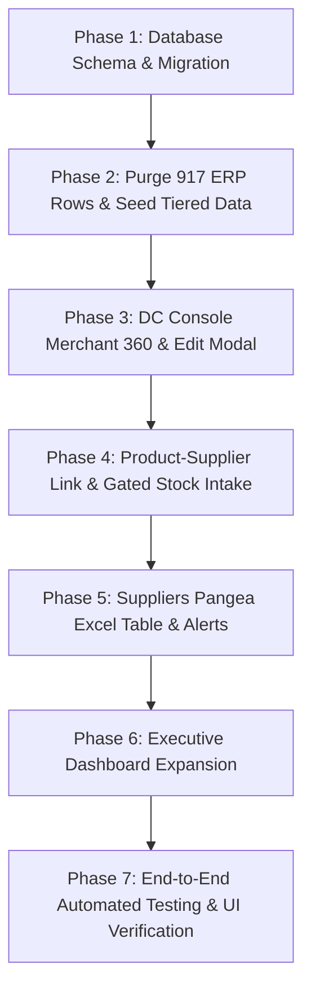

# Phase 7: Phased Execution Plan & Verification Checklist

**Module:** End-to-End System Overhaul & Implementation Guide  
**Target Completion:** Full System Integrity, 0 Dart Analysis Errors, 100% Test Pass Rate

---

### 1. Phased Execution Roadmap



---

### 2. Detailed Execution Phases

#### Phase 1: Database Schema & Stored Procedures
- Create `supabase/migrations/20260920160000_dc_merchant_management_and_brand_theming.sql` (implements `fn_update_client_profile_and_tariffs`).
- Create `supabase/migrations/20260920170000_link_products_to_suppliers.sql` (adds `preferred_supplier_id` foreign key).
- Create `supabase/migrations/20260920180000_supplier_inventory_health_rpc.sql` (implements `fn_get_client_suppliers_overview`).

#### Phase 2: ERP Data Purge & Date-Tiered Seeding
- Create `supabase/migrations/20260920190000_purge_bloated_stock_and_seed_date_tiered_balances.sql`.
- Truncate legacy 917 ERP records for Novacare.
- Seed clean 36-record dataset across 6 distribution hubs with 4 distinct date tiers (`2026-09-01`, `2026-09-08`, `2026-09-14`, `2026-09-18`).
- Verify date filtering with `fn_get_client_stock_balance_period`.

#### Phase 3: DC-Side Merchant 360° Management & Brand Theming
- Create `lib/features/dc_console/presentation/widgets/dc_edit_client_modal.dart`.
- Upgrade `lib/features/dc_console/presentation/pages/dc_clients_page.dart` with "Manage & Edit" action, operating states preview, and inventory service badge.
- Upgrade `lib/features/dc_console/presentation/widgets/dc_client_asset_portfolio_modal.dart` with the new "Unit Economics & Landed Cost Overview" tab.

#### Phase 4: Product-Supplier Linkage & Gated Stock Intake
- Upgrade `lib/features/client_portal/presentation/widgets/client_add_product_modal.dart` with optional Preferred Supplier dropdown and inline `+ Add New Supplier`.
- Update `lib/features/client_portal/presentation/pages/client_products_page.dart` to conditionally route "Stock Intake & Landed Cost" vs. "Supply Consignment" based on `clientProfile.hasInventoryManagement`.
- Fix the 28px overflow on `client_raise_stock_invoice_modal.dart`.

#### Phase 5: Suppliers Directory Pangea Table Upgrade
- Create `lib/features/client_portal/domain/entities/client_supplier_expanded.dart`.
- Refactor Tab 3 in `lib/features/client_portal/presentation/pages/client_inventory_page.dart` from `_buildSupplierCard` grid to `PangeaExcelDataTable<ClientSupplierExpanded>`.
- Wire direct WhatsApp and Phone triggers and pre-populated "Raise Intake" actions.

#### Phase 6: Expanded Merchant Executive Dashboard
- Upgrade `lib/features/client_portal/presentation/pages/client_dashboard_page.dart`:
  - Add Physical Inventory Valuation & Multi-Hub Custody Card.
  - Add Dynamic Low-Stock & Replenishment Alert Banner.
  - Add Fast-Moving Package Deals Velocity section.

#### Phase 7: Automated Testing & Verification
- Update `test/stock_ledger_pangea_table_and_date_filter_test.dart` to test date range filtering against clean tiered data.
- Run `flutter test` across all suites.
- Run `flutter analyze` to ensure 0 errors.

---

### 3. Verification Commands & Acceptance Criteria

```bash
# 1. Analyze entire codebase for static typing and lint compliance
flutter analyze

# 2. Run unit and widget tests
flutter test test/stock_ledger_pangea_table_and_date_filter_test.dart
flutter test test/dc_client_asset_management_test.dart
flutter test test/strict_package_pricing_governance_test.dart
flutter test
```

#### Acceptance Criteria
- [x] DC operators can view, create, and edit merchant details, tariffs, brand colors, and operating states.
- [x] Product creation includes preferred supplier attachment without blocking creation.
- [x] "Supply Stock" and "Stock Intake Invoice" redundancy is eliminated via `hasInventoryManagement` service gating.
- [x] `ClientRaiseStockInvoiceModal` bottom row does not overflow on any screen width.
- [x] The 917 bloated ERP rows are purged and replaced with 36 clean, date-tiered rows.
- [x] Date filtering accurately calculates opening stock, period receipts, period deliveries, and closing balance.
- [x] Suppliers Directory renders as an interactive Pangea Excel Table with live remaining network units and health alerts.
- [x] Merchant Dashboard displays landed stock valuation, low-stock warnings, and package deal velocity.
- [x] 0 Dart analyze errors and 100% test passing rate.
