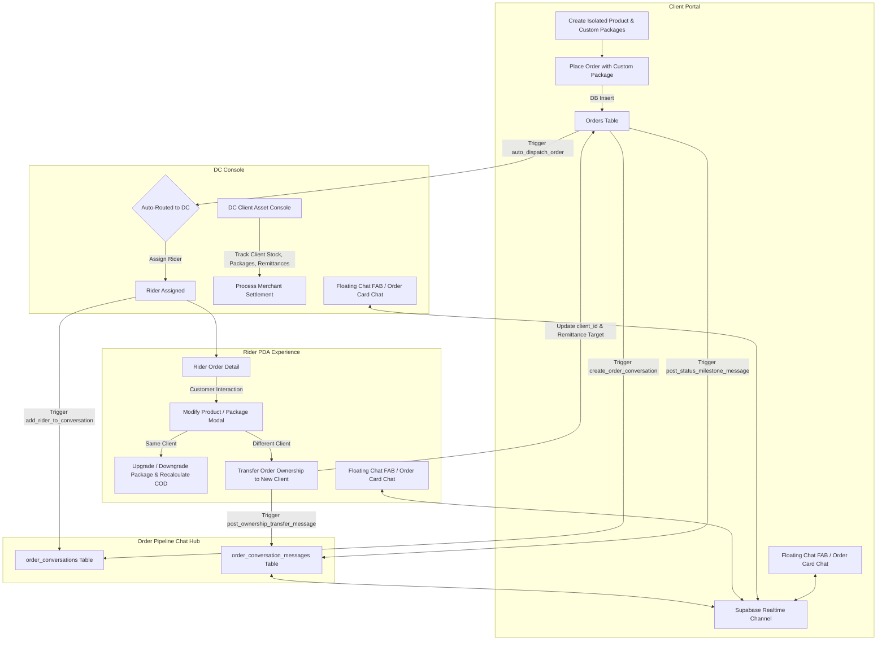

# NoveXPS Master Blueprint: Holistic System Overhaul

## 1. Executive Summary & Goals

This master blueprint defines the complete architectural overhaul of the NoveXPS platform across all tiers:
- **Supabase Database & Realtime**: Schema migrations, foreign key constraints, real-time publications, and row-level policies.
- **Database Stored Procedures & Triggers**: Autonomous triggers for conversation lifecycle, status milestone broadcasts, atomic order ownership transfers, and stock custody balancing.
- **Datasource & Repository Layer**: Total eradication of in-memory caching masks (`_createdOrders`), dynamic multi-tenant filtering, and zero-hardcoding enforcement.
- **Client Portal**: Complete tenant isolation, autonomous package deal creation (zero hardcoded 4-tier re-injection), dynamic order creation, and live settlement tracking.
- **Distribution Center (DC) Console**: DC-level client management, interactive client drill-down into a dedicated **DC Client Asset Detail Console** (Products, Stock & Waybills, Packages, Orders, Remittance Payouts), and routing optimization.
- **Rider Experience & Order Editing**: In-app modal for riders to upgrade, downgrade, or switch order products/packages during customer delivery with immediate COD recalculation, stock custody adjustments, and seamless **Order Ownership Transfer** if switching to another merchant's product.
- **In-App WhatsApp-Style Instant Messaging**: Real-time group chat between Client + DC + Rider with a global Floating Action Button (FAB), unread badges, order cards integration, and automated milestone system pills.

---

## 2. Master System Interaction Diagram

---

## 3. Modular Implementation Plan Index

| Document | Focus Area | Scope & Description |
|---|---|---|
| [**01_SUPABASE_SCHEMA_AND_MIGRATIONS.md**](file:///c:/PROJECT/NoveXPS/docs/plans/01_SUPABASE_SCHEMA_AND_MIGRATIONS.md) | Database & Realtime | Complete DDL for `order_conversations`, `order_conversation_messages`, column enhancements on `products`, `orders`, `client_settlements`, realtime publication, indexes. |
| [**02_STORED_PROCEDURES_AND_TRIGGERS.md**](file:///c:/PROJECT/NoveXPS/docs/plans/02_STORED_PROCEDURES_AND_TRIGGERS.md) | PostgreSQL Logic | Automatic conversation creation, participant syncing, order milestone events, atomic order product/ownership transfer procedure. |
| [**03_DATA_SOURCES_AND_ZERO_HARDCODING_SWEEP.md**](file:///c:/PROJECT/NoveXPS/docs/plans/03_DATA_SOURCES_AND_ZERO_HARDCODING_SWEEP.md) | Datasources & Repositories | Eradicating in-memory static orders, fixing all 19 cataloged hardcoded files, dynamic auth & tenant scoping. |
| [**04_CLIENT_PORTAL_AUTONOMOUS_PACKAGES.md**](file:///c:/PROJECT/NoveXPS/docs/plans/04_CLIENT_PORTAL_AUTONOMOUS_PACKAGES.md) | Client Portal | Tenant-scoped product catalog, autonomous package creation without forced defaults, dynamic order placement, live settlement tracking. |
| [**05_DC_CLIENT_ASSET_MANAGEMENT_CONSOLE.md**](file:///c:/PROJECT/NoveXPS/docs/plans/05_DC_CLIENT_ASSET_MANAGEMENT_CONSOLE.md) | DC Console | Interactive client rows, new **DC Client Asset Detail Console** (5 tabs: Profile, Products/Stock, Packages, Orders, Remittances), priority routing. |
| [**06_RIDER_ORDER_EDITING_AND_OWNERSHIP_TRANSFER.md**](file:///c:/PROJECT/NoveXPS/docs/plans/06_RIDER_ORDER_EDITING_AND_OWNERSHIP_TRANSFER.md) | Rider PDA & Delivery | Rider product/package editing modal, price recalculation, vehicle custody balance updates, ownership transfer to new merchant, audit logging. |
| [**07_WHATSAPP_STYLE_PIPELINE_MESSAGING.md**](file:///c:/PROJECT/NoveXPS/docs/plans/07_WHATSAPP_STYLE_PIPELINE_MESSAGING.md) | Real-Time Chat | WhatsApp UI, Floating Action Button (FAB) with badge, Pipeline Chat Hub, Order Chat Room, automated milestone pills, live sync. |
| [**08_TESTING_AND_EXECUTION_CHECKLIST.md**](file:///c:/PROJECT/NoveXPS/docs/plans/08_TESTING_AND_EXECUTION_CHECKLIST.md) | Verification & Quality | Automated integration test specs, zero-hardcoding regex scan script, manual verification test scripts, flutter analyze checklist. |

---

## 4. Zero-Hardcoding Guiding Rules

1. **No Fallback Merchant Identity**: No file may ever fall back to `'Novacale Limited'`, `'Novacare Limited'`, `'CLI-NOVACALE-01'`, or `'Dr. Chuka Okafor'`. If a client name is missing, look it up dynamically via `clients.id` or render generic placeholders like `'Merchant Client'`.
2. **No Fallback Product Catalog**: Product dropdowns and package pickers must query active Supabase tables scoped strictly to the authenticated `client_id` or handling DC.
3. **No In-Memory Masking**: All created orders, stock handovers, and remittances must persist to Supabase and be reloaded from the network. Never shadow DB queries with static Dart lists.
4. **Autonomous Package Sets**: Never re-inject standard 4-tier packages when a client deletes or customizes their packages.
