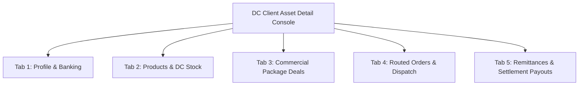

# DC Console: Client Asset Management & Routing Optimization Plan

## 1. Overview

Distribution Centers manage physical inventory and dispatch operations on behalf of multiple clients. This document details:
1. Transforming `dc_clients_page.dart` into an interactive client asset directory.
2. Creating the dedicated **DC Client Asset Detail Console** (`dc_client_asset_detail_page.dart`) with 5 comprehensive management tabs.
3. Optimizing order routing so orders assigned to a DC are reliably queried by DC ID.

---

## 2. Interactive Client Directory (`dc_clients_page.dart`)

- **Current State**: Static read-only table displaying client cards/rows with no click action or deeper visibility into client assets.
- **Enhancement**:
  - Replace static rows with interactive cards featuring hover effects, active client status indicators, depot state chips, and a prominent **"Manage Client Assets ➔"** action button.
  - Tapping a client navigates to the dedicated console: `/dc/clients/:clientId` or opens `DCClientAssetDetailPage(client: client)`.

---

## 3. Dedicated DC Client Asset Detail Console (`dc_client_asset_detail_page.dart`)

A multi-tab operations console allowing DC staff to inspect and operate on everything related to a specific client:



### Tab 1: Profile & Banking Details
- Company Name, Registration Code, Primary Contact Person, Phone, Email.
- Settlement Bank Details (Bank Name, Account Number, Account Name) for verified payout disbursements.
- Service Tier & Assigned Account Manager.

### Tab 2: Products & DC Stock Custody
- List of all products owned by this client.
- In-Hub Physical Stock Quantity (total units physically present at this DC warehouse).
- Stock in Rider Vehicle Custody (units currently assigned to riders for delivery).
- Low-Stock threshold alerts.
- **Action Button: "Receive Client Waybill Inbound"**:
  - Opens modal to log newly received physical shipment boxes from the merchant.
  - Increments DC stock count in `products.dc_stocks` and logs an inventory audit trail.

### Tab 3: Commercial Package Deals
- Displays the client's configured package bundles (e.g. 1 Box, 2 Boxes, 3 Boxes).
- Shows package pricing, paid vs promo free unit allocations.
- Gives DC dispatch supervisors full visibility into what contents should be packaged in order parcels.

### Tab 4: Routed Orders & Dispatch
- Real-time filtered list of orders originating from this client that are routed to this DC.
- Columns: Order Number, Customer Name, Address, Product & Package, COD Amount, Status, Assigned Rider.
- Quick Actions: Assign/Reassign Rider, View POD, Open Pipeline Chat.

### Tab 5: Remittances & Settlement Payout Processing
- **Financial Balance Summary**:
  - Total COD Cash Collected for this Client at this DC.
  - Total Delivery Service Fees Deducted.
  - Net Available Settlement Balance awaiting payout.
- **Historical Settlements List**:
  - Completed payouts to this client, reference codes, payout receipts.
- **Action Button: "Process Merchant Settlement"**:
  - Allows DC finance manager to mark reconciled funds as transferred to the client's bank account, automatically inserting a record in `client_settlements`.

---

## 4. DC Order Routing Optimization

### 4.1 Priority Check in `order_routing_service.dart` & `orders_provider.dart`
- **Issue**: Previously, order matching could fail if an order's state string did not exactly match the DC's state list, even when the order was explicitly assigned to the DC via `orders.distribution_center_id`.
- **Fix**:
  ```dart
  bool doesOrderBelongToDc(OrderEntity order, DistributionCenterEntity dc) {
    // 1. Direct Assignment Check (Highest Priority)
    if (order.distributionCenterId.isNotEmpty && order.distributionCenterId == dc.id) {
      return true;
    }
    // 2. Geographic Coverage Check (Fallback for unassigned orders)
    final orderState = order.deliveryState.trim().toLowerCase();
    return dc.coveredStates.any((state) => state.trim().toLowerCase() == orderState);
  }
  ```
- Ensures 100% of orders auto-routed or explicitly assigned to a DC appear instantly in the DC Console.
