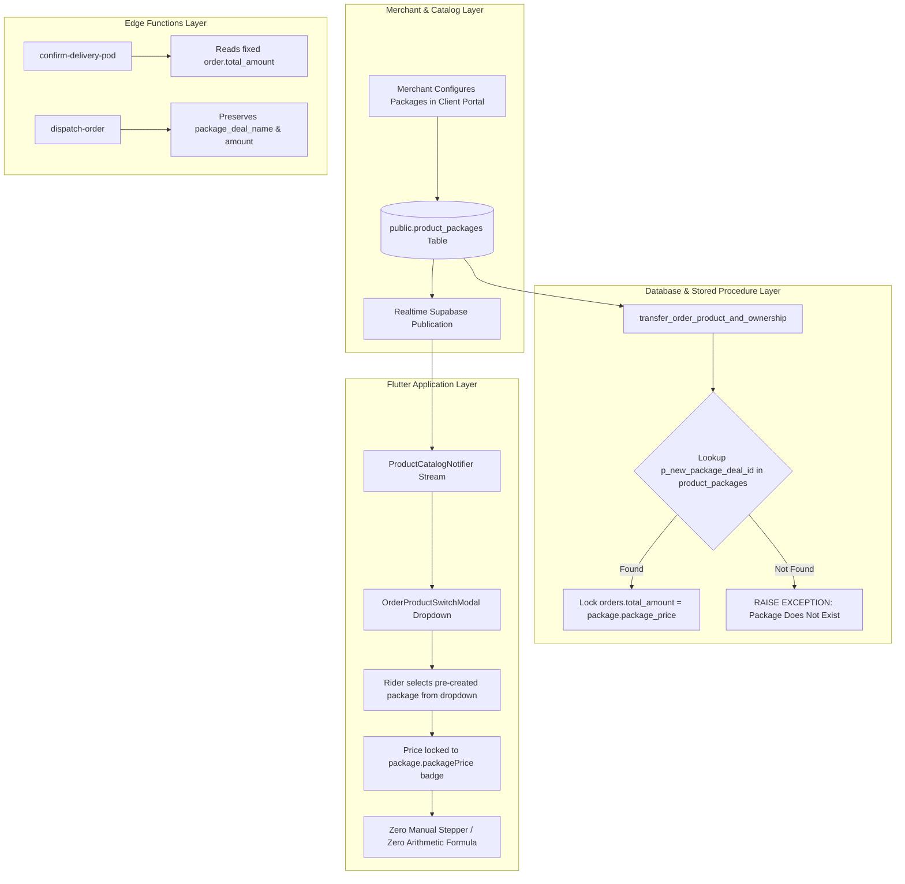

# Pre-Created Product Packages & Strict Pricing Governance Plan

## 1. Executive Summary & Core Principle

### 1.1 The Core Rule
**There must NEVER be automatic, on-the-fly, or dynamic mathematical price calculations** (e.g., multiplying unit price by quantity, discount formulas, or freeform rider input). 
Every order product upgrade, downgrade, switch, or new booking **MUST strictly select an existing, merchant-authorized package already created for that product in the `product_packages` table**.

- **Price Determination**: The order's `total_amount` is 100% determined by `product_packages.package_price`.
- **Quantity & Physical Deliverables**: The order's `quantity`, `paid_quantity`, and `free_quantity` are 100% determined by `product_packages.quantity`, `paid_quantity`, and `free_quantity`.
- **Database Enforcement**: Stored procedure `transfer_order_product_and_ownership` must fetch the authoritative price directly from `public.product_packages`, rejecting any attempt to submit an order with a package that does not exist in the database.

---

## 2. Multi-Face Architecture Plan



---

## 3. Face 1: PostgreSQL & Supabase Database Schema

### 3.1 `public.product_packages` Integrity
- Ensure table exists with complete columns:
  - `id` (TEXT PRIMARY KEY)
  - `product_id` (TEXT NOT NULL)
  - `product_name` (TEXT NOT NULL)
  - `product_sku` (TEXT)
  - `package_name` (TEXT NOT NULL)
  - `quantity` (INT NOT NULL DEFAULT 1)
  - `paid_quantity` (INT DEFAULT 1)
  - `free_quantity` (INT DEFAULT 0)
  - `package_price` (NUMERIC(14,2) NOT NULL)
  - `client_id` (TEXT / UUID)
  - `client_name` (TEXT)
  - `description` (TEXT)
  - `is_custom` (BOOLEAN DEFAULT false)
  - `created_at`, `updated_at` (TIMESTAMPTZ)
- Indexing:
  - `CREATE INDEX IF NOT EXISTS idx_product_packages_product_id ON public.product_packages(product_id);`
  - `CREATE INDEX IF NOT EXISTS idx_product_packages_client_id ON public.product_packages(client_id);`
- Realtime publication:
  - Ensure `public.product_packages` is part of `supabase_realtime` so new packages are immediately streamable to all active rider and DC client apps.

### 3.2 Database Seed Data Coverage
- Every existing product in `public.products` (`Alpha Man`, `Ura Clear`, `NC Pachaging`, `Grazer Herbal Detox Tea`, `Respira Detox Tea`, `Respira Lungs Detox Tea`, `G-World Hot Tea`) must have explicit merchant packages seeded in `public.product_packages`:
  - 1 Pack (Standard Retail)
  - 2 Packs Promo Deal
  - 3 Packs Family Bundle
  - 5 Packs Mega Saver (Buy 4 Get 1 Free)
- No product is left with 0 packages.

---

## 4. Face 2: PostgreSQL Stored Procedures

### 4.1 Update `transfer_order_product_and_ownership`
In `supabase/migrations/20260913140000_strict_package_pricing_governance.sql`:
- Procedure signature:
  ```sql
  CREATE OR REPLACE FUNCTION public.transfer_order_product_and_ownership(
      p_order_id UUID,
      p_new_product_id UUID,
      p_new_package_deal_id TEXT,
      p_actor_name TEXT,
      p_actor_role TEXT,
      p_transfer_reason TEXT
  )
  ```
  *(Or accept previous parameters with default NULLs for backward compatibility, but always override price with database package values).*
- **Authoritative Lookup**:
  ```sql
  SELECT * INTO v_package
  FROM public.product_packages
  WHERE id = p_new_package_deal_id
    AND (product_id = p_new_product_id::text 
         OR product_id = v_new_product.sku 
         OR product_name ILIKE v_new_product.name);

  IF NOT FOUND THEN
      RAISE EXCEPTION 'Invalid package deal "%" for product "%". Orders must use a pre-created authorized package.', 
          p_new_package_deal_id, v_new_product.name;
  END IF;

  -- Lock all pricing and quantity fields strictly to the package record
  v_new_package_name := v_package.package_name;
  v_new_quantity := v_package.quantity;
  v_new_paid_quantity := COALESCE(v_package.paid_quantity, v_package.quantity);
  v_new_free_quantity := COALESCE(v_package.free_quantity, 0);
  v_new_base_price := v_package.package_price;
  v_new_total_amount := v_package.package_price;
  ```
- This completely guarantees that **no client, script, or rider can submit an arbitrary total_amount or calculate their own price**.

---

## 5. Face 3: Supabase Cloud Edge Functions

### 5.1 Verification Checklist
- `supabase/functions/confirm-delivery-pod`:
  - Confirmed: Reads `order.total_amount` directly from database; does not compute discounts.
- `supabase/functions/dispatch-order`:
  - Confirmed: Preserves `order.package_deal_name` and `order.total_amount`.
- `supabase/functions/submit-cash-remittance`:
  - Confirmed: Attributes collected COD directly from order records.
- **Rule**: Edge functions never alter package amounts or apply dynamic multiplier logic.

---

## 6. Face 4: Flutter Application Implementation

### 6.1 `OrderProductSwitchModal` (`lib/features/orders/presentation/widgets/order_product_switch_modal.dart`)
1. **Dropdown of Pre-Created Packages**:
   - When a replacement product is selected, filter available packages from `productCatalogProvider`.
   - The Package Dropdown is **mandatory**.
   - If the product has no pre-created packages:
     - Render warning box: *"No pre-created packages found for this product. You cannot switch to a product that has no merchant package deals."*
     - Disable the confirmation button.
2. **Eliminate All Dynamic Price Calculation**:
   - Selecting a package locks `_selectedPackage = pkg`, `_price = pkg.packagePrice`, and `_quantity = pkg.totalPhysicalQuantity`.
   - Remove any textfield editing of price or quantity stepper.
   - Display a clean, prominent **Price Badge** showing:
     `₦35,000 (Fixed Package Deal Price)`.

### 6.2 `ProductCatalogProvider` (`lib/features/dc_console/presentation/providers/product_catalog_provider.dart`)
1. **Eradicate Synthetic Package Generation**:
   - In `getPackagesForProduct(String productName)`:
     - Return strictly `prod.packages` loaded from `product_packages` in Supabase.
     - Remove `buildDefaultPackagesForProduct` fallback calculation that computed `(p1Price * 2 * 0.85)` and `(p1Price * 3 * 0.80)`.
2. **Realtime Subscription on `product_packages`**:
   - Listen to `table: 'product_packages'` in `_subscribeToRealtimeProducts()` so changes made by merchants in the Client Portal immediately reflect in rider modals across all connected devices.

### 6.3 Order Creation Modals (`DCCreateOrderModal` & `ClientCreateOrderModal`)
1. In `DCCreateOrderModal`:
   - When a product is selected, force selection of a pre-created package from the dropdown.
   - Disable manual price and quantity modification when a commercial package is selected.
2. In `ClientCreateOrderModal`:
   - Enforce that order creation requires a valid package deal from the dropdown, locking the total order value to `packagePrice`.

---

## 7. Face 5: Verification & Testing Suite

### 7.1 Automated Integration Tests
1. **Database Price Enforcement Test (`test/rider_order_editing_and_ownership_transfer_test.dart`)**:
   - Verify that passing an authentic `package_id` updates the order amount to `package.package_price`.
   - Verify that attempting to pass an unknown or invalid `package_id` causes the database stored procedure to reject the transfer.
2. **UI Dropdown Test (`test/order_product_switch_modal_test.dart`)**:
   - Verify that package dropdown renders all pre-created packages for the selected product.
   - Verify that selecting a package updates the displayed total to the fixed package price with zero mathematical formula recalculation.
3. **Analyzer Verification**:
   - Run `flutter analyze lib/` to ensure 0 errors and 0 warnings.
