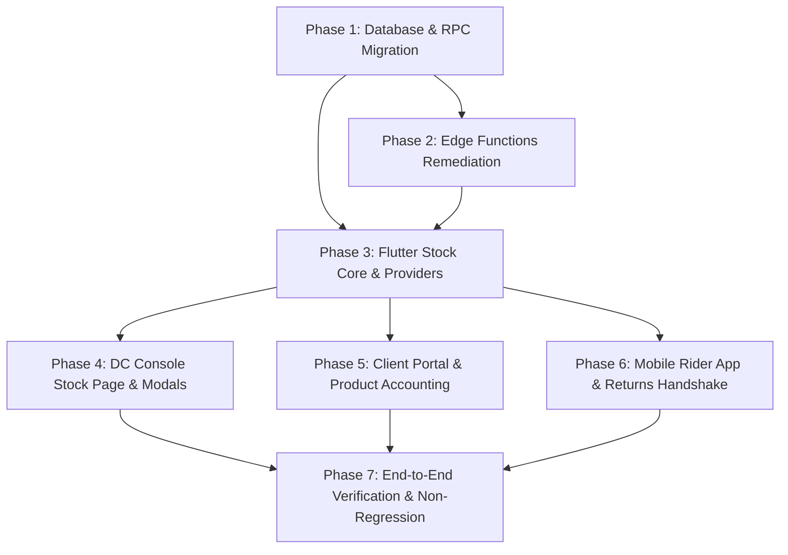

# Master Implementation Roadmap: Inventory System & Product Accounting Overhaul

**Target Directory:** `c:\PROJECT\NoveXPS\`  
**Target Environment:** Supabase Cloud (`qpcafevjsrbauweuiiyq`), PostgreSQL 15, Deno Edge Functions, Flutter Web/Mobile/Desktop.  
**Execution Mode:** Autonomous Iterative Implementation  
**Status:** Implementation Blueprint  

---

## 1. System Vision & Objective

The objective of this overhaul is to transform the inventory management and product accounting subsystems from an incomplete, partially-mocked, and mathematically inconsistent state into an **atomically consistent, double-entry inventory ledger** with complete physical-to-financial reconciliation across:
1. **Client Consignment & Inbound Stock** (Client $\rightarrow$ DC Warehouse).
2. **Distribution Center Warehouse Shelf Stock** (DC Storage Bins & Batches).
3. **Inter-DC Stock Transfers** (Source DC $\rightarrow$ Transit $\rightarrow$ Destination DC).
4. **Rider Mobile Custody & Last-Mile Dispatch** (DC Shelf $\rightarrow$ Rider Vehicle Bag).
5. **Customer Proof of Delivery (POD) & Package Bundles** (Rider Bag $\rightarrow$ Customer Handover).
6. **Rider Returns & Damaged Stock Reintegration** (Rider Bag $\rightarrow$ DC Return Quarantine $\rightarrow$ DC Shelf).
7. **Physical Stock Audits** (Periodic counting, variance detection, supervisor write-offs).
8. **Product Financial Accounting & COGS** (Retail pricing, Wholesale Cost of Goods Sold, and Gross Profit).

---

## 2. The Core Invariant Equation

Every physical unit of a product $P$ belonging to Company $C$ must obey this fundamental inventory conservation equation at all times:

$$\text{Total Global In-Stock} = \sum \text{DC Shelf Stock} + \sum \text{Rider Vehicle Custody} + \sum \text{Inter-DC In-Transit}$$

$$\text{Delivered To Date} = \sum \text{Completed Customer Deliveries (in Physical Units)}$$

$$\text{Total Procured/Supplied} = \text{Total Global In-Stock} + \text{Delivered To Date} + \text{Total Scrapped/Damaged Losses}$$

### The 4 Non-Negotiable Rules of Stock Movement:
1. **Never Double Deduct**: When DC issues stock to a rider, warehouse shelf stock decrements and rider custody increments. When the order is delivered to the customer, **only** rider custody decrements (and delivered count increments). Global shelf stock must **never** be decremented again on POD!
2. **Physical Units, Not Bundle Multipliers**: All stock deductions and custody reservations must calculate based on $\text{Total Physical Quantity} = \text{paidQuantity} + \text{freeQuantity} > 0 \ ? \ (\text{paidQuantity} + \text{freeQuantity}) : \text{quantity}$.
3. **Database as Single Source of Truth**: All rider custody must be queried from `public.agent_inventory`. No dynamic in-memory client reconstruction from historical orders!
4. **No Phantom Returns**: When a rider initiates a return, it remains in `stock_returns` in `'submitted'` status until a DC supervisor physically inspects and marks it `'approved'` / `'received'`, which atomically replenishes the DC warehouse shelf stock.

---

## 3. Implementation Phases & File Index

The implementation is broken down into 6 modular, sequential work packages. Each work package has a dedicated specification file in this directory:

| Phase | Spec File | Core Focus | Key Impacted Files |
| :--- | :--- | :--- | :--- |
| **Phase 1** | [`01_database_and_rpc_migration_plan.md`](file:///c:/PROJECT/NoveXPS/inventry%20fix/01_database_and_rpc_migration_plan.md) | PostgreSQL Migrations, Stored Procedures, & Triggers | `supabase/migrations/` (New migration file), `products`, `agent_inventory`, `stock_transfers`, `stock_returns`, `inventory_audits`. |
| **Phase 2** | [`02_edge_functions_remediation_plan.md`](file:///c:/PROJECT/NoveXPS/inventry%20fix/02_edge_functions_remediation_plan.md) | Deno Edge Functions Remediation & Bundles | `supabase/functions/confirm-delivery-pod/index.ts`, `supabase/functions/log-delivery-failure/index.ts`. |
| **Phase 3** | [`03_flutter_stock_core_and_providers_plan.md`](file:///c:/PROJECT/NoveXPS/inventry%20fix/03_flutter_stock_core_and_providers_plan.md) | Data Sources, Repositories, & State Management | `lib/features/stock/data/datasources/stock_remote_datasource.dart`, `stock_repository_impl.dart`, `stock_provider.dart`, `product_catalog_provider.dart`. |
| **Phase 4** | [`04_dc_console_stock_page_remediation_plan.md`](file:///c:/PROJECT/NoveXPS/inventry%20fix/04_dc_console_stock_page_remediation_plan.md) | DC Console Stock Page & Picking/Handover/Returns | `lib/features/dc_console/presentation/pages/dc_stock_page.dart`, `dc_assign_order_modal.dart`, `dc_handover_pin_modal.dart`. |
| **Phase 5** | [`05_client_portal_and_product_accounting_plan.md`](file:///c:/PROJECT/NoveXPS/inventry%20fix/05_client_portal_and_product_accounting_plan.md) | Wholesale COGS, Gross Profit & Financial Ledgers | `lib/features/client_portal/presentation/pages/client_finance_page.dart`, `client_products_page.dart`, `client_portal_provider.dart`. |
| **Phase 6** | [`06_mobile_rider_and_returns_handshake_plan.md`](file:///c:/PROJECT/NoveXPS/inventry%20fix/06_mobile_rider_and_returns_handshake_plan.md) | Rider App Handover, Audit, Returns & Barcode Scan | `lib/features/stock/presentation/pages/stock_page.dart`, `inventory_audit_page.dart`, `return_stock_modal.dart`, `stock_details_grazer_page.dart`. |

---

## 4. Execution Dependency Graph

---

## 5. Non-Regression & Verification Strategy

Throughout the overhaul, the following constraints must be respected:
1. **Existing Unit & Integration Tests**: Running `flutter test` must maintain 100% pass rate.
2. **Dart Analysis Integrity**: Running `flutter analyze` must produce zero errors and zero critical warnings.
3. **Database Backward Compatibility**: Schema additions must use `DEFAULT` values or nullable types so existing records remain valid.
4. **Live Development Server**: Flutter web and mobile targets must continue hot reloading without compilation halts.
